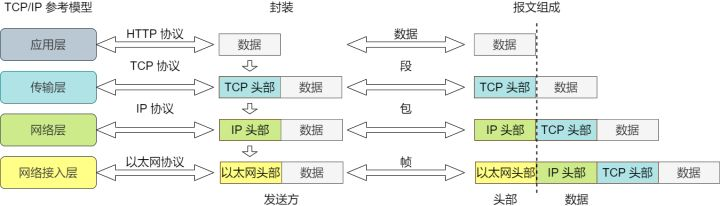
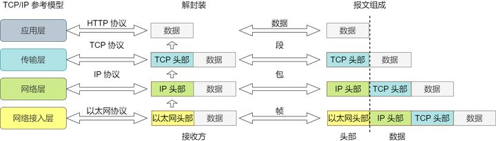

计算机网络体系结构
=======================

不同的体系结构
---------------------

.. image:: ./01_arch.png
    :width: 500px
    :align: center

七层网络体系
-------------------

**OSI** （Open System Interconnect Reference Model）：开放式系统互联参考模型。

- 物理层（pysical layer）
    把电脑连接起来的物理手段，如光缆、电缆、双绞线、无线电波。它规定了网路的一些电气属性，作用是负责传输0和1比特的电信号。

- 数据链路层（data link layer）
    物理寻址，并将比特组装成帧和点到点的传递；数据帧的生成与接收。

- 网络层（network layer）
    负责数据包从源到宿的传递和网际互连，控制子网的运行，逻辑编址、分组传输、路由选择。

- 传输层（transport layer）
    提供端到端的可靠报文传递和错误恢复。

- 会话层（session layer）
    负责建立、管理和断开通信连接，以及数据的分割等数据传输相关的管理。

- 表示层（presentation layer）
    设备固有的数据格式与网络标准数据格式之间的转换（接受不同格式的信息，如文字流、图像、声音等）。

- 应用层（application layer）
    针对特定应用的协议，如电子邮件协议、SSH、FTP、HTTP。

.. image:: ./01_osi.gif
    :width: 700px
    :align: center

数据传输
-----------------

对等层之间是不能直接通信的，上下层之间有严格依赖。

封装
^^^^^^^^^^^

通常，为协议提供的信息为 **包头部** ，所要发送的内容为 **数据** 。每个分层中，都会对所发送的数据附加一个头部，在这个头部中包含了该层必要的信息，如发送的目标地址以及协议相关信息。从下一层的角度看，从上一层收到的包全部都被认为是本层的数据。

数据发送前，按照参考模型 **从上到下** ，在数据经过每一层时，添加协议报文头部信息，这个过程叫封装。

经过传输层协议封装后的数据称为 **段** ，经过网络层协议封装后的数据称为 **包** ，经过数据链路层协议封装后的数据称为 **帧** ，物理层传输的数据为 **比特** 。

解封装
^^^^^^^^^^^^

数据接收后，按照参考模型 **从下到上** ，在数据经过每一层时，去掉协议头部信息，这个过程叫解封装。

参考资料
----------------

1. 七层网络结构

  https://blog.csdn.net/u010359398/article/details/82142449

2. 36张图详解网络基础知识

  https://zhuanlan.zhihu.com/p/364036628

3. 详解 四层、五层、七层 计算机网络模型

  https://juejin.cn/post/6844904049800642568

4. OSI七层模型及对应的网络协议

  https://www.huaweicloud.com/articles/ea09f52300d846d18c01995e485c9181.html
