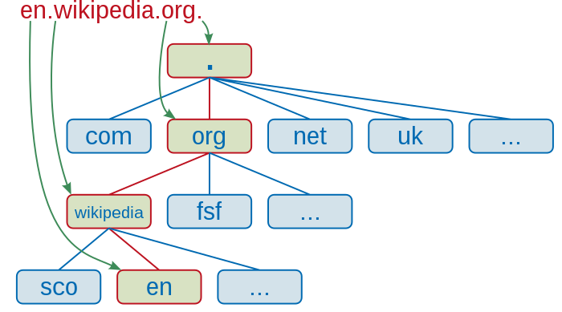

域名
=======

域名（Domain Name）是由一串用点 ``.`` 分隔的字符组成的互联网上某一台计算机或计算机组的名称，用于在数据传输时标识计算机的电子方位。域名可以说是一个 IP 地址的代称，目的是为了便于记忆后者。例如， ``wikipedia.org`` 是一个域名，人们可以直接访问 ``wikipedia.org`` 来代替 IP 地址，然后域名系统（Domain Name System，DNS）就会将它映射成便于机器识别的 IP 地址。

在域名系统的层次结构中，各种域名都隶属于域名系统 **根域** 的下级。域名的第一级是顶级域，它包括通用顶级域（例如 ``.com`` ``.net`` ``.org`` ）以及国家和地区顶级域（例如 ``.us`` ``.cn``  ）等。顶级域名下一层是二级域名，一级一级地往下。

域名管理
------------

美国的互联网名称与数字地址分配机构（ICANN）负责互联网域名空间的开发和架构，只有经过它授权的域名注册管理机构和域名注册商，才能对外界提供顶级域名管理和注册服务。另外，互联网号码分配局（IANA）负责运营域名系统根区域（Root Zone）、委派顶级域名的管理，并负责 ``.int`` 和 ``.arpa`` 两个域名的管理。

域名层次
-------------

域名语法
^^^^^^^^^^^^

域名通过点号 ``.`` 将多个标签连接在一起。一个域名的层次结构，从右侧到左侧隔一个点依次下降一层，每个标签可以包含 1 到 63 个 ASCII 字符（八字节）。完整域名的所有字符加起来不得超过 253 个 ASCII 字符，因此当每一级都使用单个字符时，总共有 127 个层次（127 个字符加上 126 个点的总长度为 253）。

域名的结尾有时候还有一点，这是保留给 **根节点（根域）** 的，书写时通常省略，在查询时由软件内部补上。

域名里的英文字母不区分大小写，一般都以小写形式拼写。

顶级域
^^^^^^^^^^^^

顶级域（Top-Level Domains，TLD）是域名中最高的一级，每个域名都以顶级域结尾。

顶级域名主要分成以下几类：

- 基础设施顶级域（ARPA）

  - ``.arpa``

- 通用顶级域（gTLD）

  - ``.com`` 商业机构（现无限制）
  - ``.edu`` 教育机构
  - ``.gov`` 政府机构
  - ``.mil`` 军事机构
  - ``.net`` 网络服务供应商使用（现无限制）
  - ``.org`` 不属于其他通用顶级域类别的组织（现无限制）
  - ...

- 通用受限制顶级域（grTLD）

- 赞助类顶级域（sTLD）

- 国家和地区顶级域（ccTLD）

  - 中国大陆 ``.cn`` 
  - 日本 ``.jp`` 
  - ...

- 测试顶级域（tTLD）

  - ``.test``

根据 IANA `Top-Level Domain List <https://data.iana.org/TLD/tlds-alpha-by-domain.txt>`_ ，截至 2022-10-24 ，共有 1485 个有效顶级域名。

根域名服务器
-------------

根域名服务器（Root Name Server）是域名系统（DNS）中最高级别的域名服务器，负责维护 DNS 根区文件 `Root Zone File <https://www.internic.net/domain/root.zone>`_ ，该文件保存了所有顶级域名（TLD）的托管信息，文件大小约 2 MB。对于收到的顶级域解析请求，它会返回顶级域的域名服务器 IP 地址。它们是互联网基础设施中的重要部分，因为所有域名解析操作均离不开它们。

由于 DNS 和某些协议的共同限制，根域名服务器地址的数量被限制为 13 个。根域名服务器会部署多个节点，共用 IP。此外，采用任播（Anycast）技术架设镜像服务器可解决数量限制，使得实际运行的根域名服务器数量大大增加。
全球 13 组根域名服务器以英文字母 ``a`` 到 ``m`` 依序命名，域名格式为 ``[a-m].root-servers.net`` 。

域名解析的工作流程
^^^^^^^^^^^^^^^^^^^^^

域名系统的每一级只知道直接下级的位置，而无法获得跨级的位置，因此在域名解析的时候，需要自上而下、逐级查询。这种机制虽然看似低效，却能够提供分布式、高容错的服务，避免让域名系统成为一个集中式的单点系统。

假如我要访问 ``www.example.com`` ：

- 1. 客户端首先会发出一个 DNS 请求给本地 DNS 服务器，请求查询 ``www.example.com`` 的 IP 。本地 DNS 服务器，属于递归解析器（DNS Recursive Resolver），一般是网络运营商提供的 DNS，也可手动修改为公共 DNS。

- 2. 本地 DNS 服务器收到客户端的请求后，如果缓存里中能找到 ``www.example.com`` ，则直接返回 IP 地址；如果没有，本地 DNS 会去向根域名服务器查询。

  - 本地 DNS 服务器至少需要知道一台根域名服务器的 IP 地址，否则就会陷入循环查询。一般来说，DNS 递归解析器都会保存一份根域名服务器的 IP 地址（IPv4 + IPv6）的配置 `Root Hints File <https://www.internic.net/domain/named.root>`_ 。

- 3. 根域名服务器收到来自本地 DNS 的请求后，发现顶级域是 ``.com`` ，即返回 ``.com`` 顶级域名服务器地址。根区文件中，顶级域名 ``.com`` 可以查到 13 个域名服务器：

  .. code-block:: text
    :linenos:

    com.			172800	IN	NS	a.gtld-servers.net.
    com.			172800	IN	NS	b.gtld-servers.net.
    com.			172800	IN	NS	c.gtld-servers.net.
    com.			172800	IN	NS	d.gtld-servers.net.
    com.			172800	IN	NS	e.gtld-servers.net.
    com.			172800	IN	NS	f.gtld-servers.net.
    com.			172800	IN	NS	g.gtld-servers.net.
    com.			172800	IN	NS	h.gtld-servers.net.
    com.			172800	IN	NS	i.gtld-servers.net.
    com.			172800	IN	NS	j.gtld-servers.net.
    com.			172800	IN	NS	k.gtld-servers.net.
    com.			172800	IN	NS	l.gtld-servers.net.
    com.			172800	IN	NS	m.gtld-servers.net.

  根区文件同时指明了这些域名服务器的 IP 地址，如：

  .. code-block:: text
    :linenos:

    a.gtld-servers.net.	172800	IN	A	192.5.6.30
    a.gtld-servers.net.	172800	IN	AAAA	2001:503:a83e:0:0:0:2:30
    b.gtld-servers.net.	172800	IN	A	192.33.14.30
    b.gtld-servers.net.	172800	IN	AAAA	2001:503:231d:0:0:0:2:30
    c.gtld-servers.net.	172800	IN	A	192.26.92.30
    c.gtld-servers.net.	172800	IN	AAAA	2001:503:83eb:0:0:0:0:30
    d.gtld-servers.net.	172800	IN	A	192.31.80.30
    d.gtld-servers.net.	172800	IN	AAAA	2001:500:856e:0:0:0:0:30
    ...

  ``.com`` 域名的解析结果，可以到这 13 个服务器的任一台查询。

- 4. 本地 DNS 服务器收到顶级域名服务器的地址后，向顶级域名服务器发起查询。

- 5. 顶级域名服务器返回 ``example.com`` 的权威域名服务器的地址。

- 6. 本地 DNS 转向权威域名服务器查询 ``www.example.com`` 对应的 IP。

- 7. 权威域名服务器查询后将对应的 IP 地址告诉本地 DNS 服务器。

- 8. 本地 DNS 服务器再将 IP 地址返回给客户端，客户端和目标建立连接。

dig 命令
-----------

dig 命令是查询 DNS 域名服务器的工具，它执行 DNS 搜索并打印收到请求的域名服务器的响应信息，是常用的 DNS 故障诊断工具。

``dig www.baidu.com`` 结果如下：

.. code-block:: text
  :linenos:

  ; <<>> DiG 9.10.6 <<>> www.baidu.com
  ;; global options: +cmd
  ;; Got answer:
  ;; ->>HEADER<<- opcode: QUERY, status: NOERROR, id: 56798
  ;; flags: qr rd ra; QUERY: 1, ANSWER: 3, AUTHORITY: 0, ADDITIONAL: 0

  ;; QUESTION SECTION:
  ;www.baidu.com.			IN	A

  ;; ANSWER SECTION:
  www.baidu.com.		900	IN	CNAME	www.a.shifen.com.
  www.a.shifen.com.	600	IN	A	180.101.49.13
  www.a.shifen.com.	600	IN	A	180.101.49.14

  ;; Query time: 9 msec
  ;; SERVER: 192.168.1.1#53(192.168.1.1)
  ;; WHEN: Wed Oct 26 00:34:12 CST 2022
  ;; MSG SIZE  rcvd: 90

**ANSWER SECTION** 部分返回了解析的 IP 地址，在浏览器地址栏输入 ``180.101.49.13`` 或 ``180.101.49.14`` 即会跳转到百度首页。

.. attention::

    直接使用 IP 地址可能无法访问网站
      IP 地址实际上标识了一个服务器，而不是网站，同一个服务器可能挂载了多个网站。单独依靠 IP 地址不能确定匹配到哪个网站。有些服务器会定义默认的网站，当收到 IP 地址的请求时，就返回默认的网站给客户端。

使用命令 ``dig @8.8.8.8 +trace www.baidu.com`` 可以看到完整的解析过程。 ``@8.8.8.8`` 表示使用公共域名服务器，而不是依次使用 ``/etc/resolv.conf`` 里配置的本地域名服务器进行查询。

    .. container:: toggle

      .. container:: header

          *dig @8.8.8.8 +trace www.baidu.com*

      .. code-block:: text
          :linenos:
          :emphasize-lines: 18,35,46,49

          ; <<>> DiG 9.10.6 <<>> @8.8.8.8 +trace www.baidu.com
          ; (1 server found)
          ;; global options: +cmd
          .			68139	IN	NS	e.root-servers.net.
          .			68139	IN	NS	a.root-servers.net.
          .			68139	IN	NS	l.root-servers.net.
          .			68139	IN	NS	b.root-servers.net.
          .			68139	IN	NS	d.root-servers.net.
          .			68139	IN	NS	m.root-servers.net.
          .			68139	IN	NS	h.root-servers.net.
          .			68139	IN	NS	k.root-servers.net.
          .			68139	IN	NS	j.root-servers.net.
          .			68139	IN	NS	f.root-servers.net.
          .			68139	IN	NS	g.root-servers.net.
          .			68139	IN	NS	i.root-servers.net.
          .			68139	IN	NS	c.root-servers.net.
          .			68139	IN	RRSIG	NS 8 0 518400 20221107050000 20221025040000 18733 . jjPuMT1Y8vXX82riF3UJ+hKsYgtYZuuTJYLaLJm/8n0A3oj5q4lEpxC1 JvhIylz3wAKa3jqhMKNtT7WE6+rD3726+IUCso4QzGIl7xXhKK6nOXef Y5ITJ8CSuRWEEg98hUI89PmYf26M0Sb5/dDYjqBFR1TZSROiE+OrwTbt OSv5SLzteSmH9GQZWRgrXCGhrqja4BqLu9gDuGXUdD4yEi9XKWoQTYX4 x7FqCrE+YDymQhQ6nq3TZ5qN+wN5iQrF6g3FDbM2SETyUzyfePKPeuS1 CSgcVqdbjIuA8W3/ItI2M89Puukes8toBZBgv1rYzU41veOzGoP5yE4J 948vdA==
          ;; Received 525 bytes from 8.8.8.8#53(8.8.8.8) in 78 ms

          com.			172800	IN	NS	e.gtld-servers.net.
          com.			172800	IN	NS	b.gtld-servers.net.
          com.			172800	IN	NS	j.gtld-servers.net.
          com.			172800	IN	NS	m.gtld-servers.net.
          com.			172800	IN	NS	i.gtld-servers.net.
          com.			172800	IN	NS	f.gtld-servers.net.
          com.			172800	IN	NS	a.gtld-servers.net.
          com.			172800	IN	NS	g.gtld-servers.net.
          com.			172800	IN	NS	h.gtld-servers.net.
          com.			172800	IN	NS	l.gtld-servers.net.
          com.			172800	IN	NS	k.gtld-servers.net.
          com.			172800	IN	NS	c.gtld-servers.net.
          com.			172800	IN	NS	d.gtld-servers.net.
          com.			86400	IN	DS	30909 8 2 E2D3C916F6DEEAC73294E8268FB5885044A833FC5459588F4A9184CF C41A5766
          com.			86400	IN	RRSIG	DS 8 1 86400 20221107050000 20221025040000 18733 . 2eKdbL4avnkLVFcFThwzZnPLYLecGO15wajb8QNcPVmfygXvTCyrnQW+ WQ77FejfdSaf8oz0mdcbyMTo1GXrIutCXqitKpu4mHZemZVhDuTXqkeV P4n/KtkPUldtmvI/Sa46Ah/jkqdFVFh62lMdkenYp+nNaEiqjheIeWtW diEwqPRIUKwA+FozM5Xl9i2OX0CsYw7b0JQmOaBglYVoYabFrcsLOqS5 nUkLOje1gzOqeNQHLMocXfo9MwD2h+1UfVbUHVt2BCjTbMj7eyUEOCq7 Clb0G9I5a3MloflVFTMRjmPz7fVd3ti5X1l0YRfKhbfISxQnkSriCmLp w90i8g==
          ;; Received 1173 bytes from 192.58.128.30#53(j.root-servers.net) in 183 ms

          baidu.com.		172800	IN	NS	ns2.baidu.com.
          baidu.com.		172800	IN	NS	ns3.baidu.com.
          baidu.com.		172800	IN	NS	ns4.baidu.com.
          baidu.com.		172800	IN	NS	ns1.baidu.com.
          baidu.com.		172800	IN	NS	ns7.baidu.com.
          CK0POJMG874LJREF7EFN8430QVIT8BSM.com. 86400 IN NSEC3 1 1 0 - CK0Q2D6NI4I7EQH8NA30NS61O48UL8G5  NS SOA RRSIG DNSKEY NSEC3PARAM
          CK0POJMG874LJREF7EFN8430QVIT8BSM.com. 86400 IN RRSIG NSEC3 8 2 86400 20221030042404 20221023031404 53929 com. rZituN5sci3BirVdxM4h2GBR4G1bkLTMrniYA9FAFGfxOMcDl4Fuh97f NCZDlbS1GO/PQ0FDpdwVFZ/T+tJnRyHOJxnhHFj72PuFrfGe42FGYO04 FUzo+w9D3p4nke7owPPa+NDdWnO2L1KHScU3YdsRiPCVFi+6uKhPSdpG QXG98ERm759Vkg3EYum4ML3wXBfYPpTc4L1eCRon28iiOg==
          HPVUVSGH5TFIA7CM6SS6SMPOS87OE0CE.com. 86400 IN NSEC3 1 1 0 - HPVV8SARM2LDLRBTVC5EP1CUB1EF7LOP  NS DS RRSIG
          HPVUVSGH5TFIA7CM6SS6SMPOS87OE0CE.com. 86400 IN RRSIG NSEC3 8 2 86400 20221030053622 20221023042622 53929 com. nDYPQZggx91aaAJR5UNDvY5DbmZAEDw9W9o+ja0RdDKoTd674kecZqag S7NYdh05TUdKAVp6YNv/SjDtTFoJtzhAYlCay21VzoxVFO9/04/sQcWJ xfT+uRyF/RU359h9PEHx08fk/CXGLFUGasK/Y82u1m2OLESicewMAc8h zCYrXWOkQKqacKtSSXEBX2qb1rygJDieMTDRovWd94uFmg==
          ;; Received 849 bytes from 192.42.93.30#53(g.gtld-servers.net) in 170 ms

          www.baidu.com.		1200	IN	CNAME	www.a.shifen.com.
          ;; Received 72 bytes from 220.181.33.31#53(ns2.baidu.com) in 36 ms

查询网站 IP 地址还可以通过如下方式：

- ``nslookup www.baidu.com``

  .. code-block:: text
    :linenos:

    Server:   192.168.1.1
    Address:  192.168.1.1#53

    Non-authoritative answer:
    www.baidu.com	canonical name = www.a.shifen.com.
    Name:	www.a.shifen.com
    Address: 180.101.49.14
    Name:	www.a.shifen.com
    Address: 180.101.49.13

- ``ping -c 5 www.baidu.com``

  .. code-block:: text
    :linenos:

    PING www.baidu.com (180.101.49.14): 56 data bytes
    64 bytes from 180.101.49.14: icmp_seq=0 ttl=53 time=20.753 ms
    64 bytes from 180.101.49.14: icmp_seq=1 ttl=53 time=20.324 ms
    64 bytes from 180.101.49.14: icmp_seq=2 ttl=53 time=20.617 ms
    64 bytes from 180.101.49.14: icmp_seq=3 ttl=53 time=20.687 ms
    64 bytes from 180.101.49.14: icmp_seq=4 ttl=53 time=12.662 ms

    --- www.baidu.com ping statistics ---
    5 packets transmitted, 5 packets received, 0.0% packet loss
    round-trip min/avg/max/stddev = 12.662/19.009/20.753/3.177 ms

- ``host www.baidu.com``

  .. code-block:: text
    :linenos:

    www.baidu.com is an alias for www.a.shifen.com.
    www.a.shifen.com has address 180.101.49.13
    www.a.shifen.com has address 180.101.49.14

对同一个网站查询得到的 IP 地址并不是固定唯一的，网站服务器可能有很多（负载均衡）。

.. note::

    查询百度 IP 的时候可以发现， ``www.baidu.com`` 是 ``www.a.shifen.com.`` 的一个别名。

.. tip::

  查询本机 IP 地址：

    使用指令 ``ip addr | grep inet`` 或 ``ifconfig | grep inet`` （Windows 使用 ``ipconfig`` ）查询得到的是本机的局域网/内网/私有 IP 地址。这类 IP 地址形式如：

    - 10.x.x.x

    - 172.16.x.x - 172.31.x.x

    - 192.168.x.x

    - ...

    多个内部主机可以使用同一个公网 IP 地址上网（NAT网络地址转换），以达到节省 IP 地址的作用。

    要想得到公网/外网/公有 IP 地址，可使用 curl 命令：

    - ``curl ifconfig.me``

    - ``curl www.cip.cc``

    - ...

    运营商可能有多个出口，因此在不同网站上看到的公网 IP 地址可能不同。

参考资料
-------------

1. 域名

  https://zh.wikipedia.org/wiki/%E5%9F%9F%E5%90%8D

2. 互联网顶级域列表

  https://zh.wikipedia.org/wiki/%E4%BA%92%E8%81%94%E7%BD%91%E9%A1%B6%E7%BA%A7%E5%9F%9F%E5%88%97%E8%A1%A8

3. 根域名服务器

  https://zh.wikipedia.org/wiki/%E6%A0%B9%E7%B6%B2%E5%9F%9F%E5%90%8D%E7%A8%B1%E4%BC%BA%E6%9C%8D%E5%99%A8

4. 根域名的知识

  https://www.ruanyifeng.com/blog/2018/05/root-domain.html

5. Root Files

  https://www.iana.org/domains/root/files

6. 应用层 DNS 协议、相关命令总结

  https://qidawu.github.io/