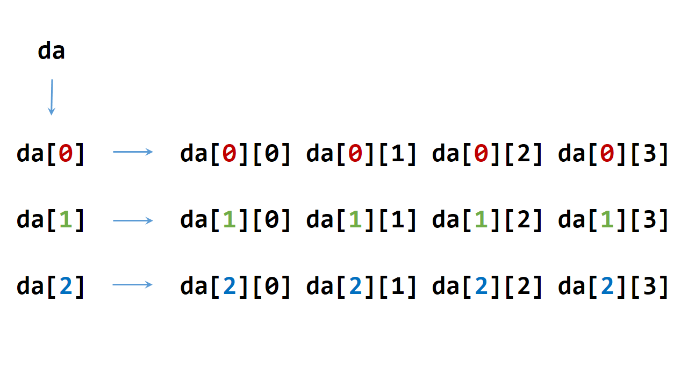

数组
========

指针
--------

.. code-block:: cpp
  :linenos:

  #include <ctime>
  using namespace std;

  struct TreeNode
  {
    int val;
    TreeNode* left;
    TreeNode* right;
    TreeNode(int x) :val(x), left(nullptr), right(nullptr){} /* 唯一的构造函数，必须给的参数x */
  };

  int main(int argc, char ** argv)
  {
    //int* p = new int(1); /* 这两行与下面三行等效 */
    //cout << *p << endl;
    int* p = new int;
    *p = 1;                /* p已经申请了内存空间，可以直接赋值 */
    cout << *p << endl;

    TreeNode* q = new TreeNode(10);
    cout << q->val << endl;

    TreeNode node(100);
    TreeNode* r = &node;   /* r 不能delete */
    cout << r->val << endl;

    delete p;
    delete q;

    return 0;
  }

动态数组
----------

声明与定义一个动态数组的格式一般如下：

.. code-block:: cpp
    :linenos:

    int** da = new int*[r];
    for(int i = 0; i < r; ++i)
    {
        da[i] = new int[c];
    }

內存释放：

.. code-block:: cpp
    :linenos:
    :emphasize-lines: 4,7

    for(int i = 0; i < r; ++i)
    {
        delete[] da[i]; // 释放指针指向的内存空间
        da[i] = nullptr; // 置为空指针，防止出现‘野指针’
    }
    delete[] da;
    da = nullptr;

内存组织形式::

  动态数组在堆(heap)区分配内存，静态数组在栈(stack)区分配內存。

假如我们已经得到一个3x4的动态数组da，其指针关系如下：

其中，da[0]、da[1]、da[2]的地址是连续的，依次相差 ``sizeof(da[0])`` (一个指针的大小，32位编译器下为4，64位编译器下为8)，比如::

  &da[0] + sizeof(da[0]) == &da[1]

如果把da看作3行4列的二维数组，那么da的每一行元素的地址是连续的，依次相差 ``sizeof(da[0][0])`` ；但是行与行之间的地址是不连续的，比如::

  da[0][0], da[0][1], da[0][2], da[0][3]地址连续；
  da[1][0], da[1][1], da[1][2], da[1][3]地址连续；
  da[0][3]与da[1][0]地址不连续；

另外::

  &da, &da[0], &da[0][0]三者的数值是不相等的。
  如果数组是静态数组，则&da, &da[0], &da[0][0]三者的数值是相等的；
  且静态数组的行与行之间的地址连续。

.. note::

   对于动态数组，指针的地址和指针的值不能混淆，我们讲da[0]、da[1]、da[2]的地址是连续的，但是他们本身的值没有关系，即 ``da[0] + sizeof(da[0]) != da[1]`` 。
   注意有没有 ``&`` 的区别。

如果想要定义连续内存空间的动态数组，可以按如下方式进行：

.. code-block:: cpp
   :linenos:

   // int** f; // f的声明
   template<typename T>
   void Init2DArray(T** &f, const int row, const int col)
   {
       f = new T*[row];
       f[0] = new T[row * col];
       for(int i = 1; i < col; ++i)
       {
           f[i] = f[0] + col * i;
       }
   }

内存释放方式如下：

.. code-block:: cpp
   :linenos:

   template<typename T>
   void Delete2DArray(T** &f)
   {
       if(f != nullptr)
       {
           if(f[0] != nullptr)
           {
               delete[] f[0];
               f[0] = nullptr;
           }
           delete[] f;
           f = nullptr;
       }
   }

上面的 ``Init2DArray`` 在申请内存的时候，建立了row x col的二维动态数组。实际上，二维动态数组不强求列对齐，即各行的长度可以不一样，
因此可以下面像这样定义::

 f[i] = f[0] + offset_i; // offset_i是第i行首地址相对于第0行首地址的偏移量

另类的数组表达
-----------------------

有如下程序：

.. code-block:: cpp
  :linenos:

  int a[10];
  int b[7][5];

  0[a] = 5;
  9[a] = 7;
  0[b][0] = 1;
  0[b][1] = 2;
  0[b][2] = 3;

这些表达式能够正常编译和执行，是因为对于C/C++而言::

  a[0]等价于*a等价于*(a+0)等价于*(0+a) ==> 等价于0[a];

所以可以推出二维表达式::

  b[0][1] = *(b[0] + 1) = *(1 + b[0]) = 1[b[0]]
  b[0][1] = *(*(b+0) + 1) = *(*(0+b) + 1) = *(0[b] + 1) = 0[b][1]
  b[0][1] = *(*(b+0) + 1) = *(1 + *(0+b)) = 1[0[b]]

数组实参
------------

以 **非引用** 类型传递数组实参时，数组会退化为指针，形参复制的是这个指针的值(指向数组的第一个元素)。通过指针形参做的任何改变，都是在修改数组元素本身。

如果以 **引用** 形式传递数组实参，那么编译器不会将数组实参转化为指针，而是传递数组的引用本身。

编译器会检查数组实参的大小与形参大小是否匹配。

非引用形式：

.. code-block:: cpp
    :linenos:

    void func1(int *arr);// 函数可能会改变数组
    void func2(const int *arr);// 不能改变数组

    void func3(int arr[100])
    {
        cout << sizeof(arr) << endl;// 4
    }
    // int arr[100];
    // func3(arr); // 调用func3

引用形式：

.. code-block:: cpp
    :linenos:

    void func4(int (&arr)[100])
    {
        cout << sizeof(arr) << endl;// 100
    }
    // int arr[100];
    // func4(arr); // 调用func4

数组地址与加法
-----------------

假设我们已经定义了一个数组：

.. code::

  Type a[L][M][N] = {...};

**1**. ``a`` , ``a[0]`` , ``a[0][0]`` , ``&a`` , ``&a[0]`` , ``&a[0][0]`` , ``&a[0][0][0]`` 的数值都是一样的。

**2**. ``&a`` 是4级指针, 类型是 ``int (*)[L][M][N]`` ，指向a这个数组。

**3**. ``a`` 是3级指针，类型是 ``int (*)[M][N]`` ，三维数组的数组名，是数组a的首地址。

**4**. 大小计算如下::

    sizeof(&a) = 4;// 指针的大小，32位编译器
    sizeof(a[0][0][0]) = sizeof(Type);
    sizeof(a[0][0]) = N * sizeof(Type);
    sizeof(a[0]) = M * N * sizeof(Type);
    sizeof(a) = L * M * N * sizeof(Type);// 整个数组的大小

**5**. 加法运算::

    a + i = a + i * sizeof(a[0]);
    &a + i = a + i * sizeof(a);
    这里（&a + 1）就已经跳过了整个数组。

**6**. 定义指针 ``int *ptr = (int *)(&a + 1)`` ，则 ``(ptr - 1)`` 指向数组a的最后一个元素。

malloc/free与new/delete
--------------------------------

相同点
^^^^^^^^^

都可用于申请动态内存和释放内存。

不同点
^^^^^^^^^^

1. 属性

    ``malloc/free`` 是C/C++的 **库函数** ，在头文件 ``stdlib.h`` 中声明。

    .. code-block:: cpp

      void *malloc(size_t size);
      void free(void *pointer);

    因为malloc()函数的返回值类型为 ``void*`` ，所以需要在函数前面进行相应的强制类型转换。

    ``new/delete`` 是C++的 **运算符** 。

2. 参数

    使用new操作符申请内存分配时无须指定内存块的大小，编译器会根据类型信息自行计算；

    .. code::

      int *pi=new int[n]; //指针pi指向长度为n的数组，未初始化

    而malloc则需要显式地指出所需内存的尺寸。

    .. code::

      int *p=(int *)malloc(25*sizeof(int)); //指向整型的指针p指向一个25个int整型空间的地址
      int *p=(int *)malloc(99); //指向整型的指针p指向一个大小为99字节的内存的地址

    malloc可以分配任意字节，new 只能分配实例所占内存的整数倍数大小。

3. 分配失败

    new内存分配失败时，会抛出 ``bad_alloc`` 异常；malloc分配内存失败时返回 ``NULL`` 。

4. 功能

    new做两件事，先分配内存，再调用类的构造函数；同样，delete会调用类的析构函数和释放内存。而malloc和free只是分配和释放内存。

    对于内部数据类型(如 ``int`` , ``char`` 等)的对象，没有构造和析构的过程，对它们而言， ``malloc/free`` 和 ``new/delete`` 等价。

    对于非内部数据类型的对象而言， ``malloc/free`` 无法满足动态对象的要求。

5. 重载(overload)

    ``new/delete`` 可以重载成为函数，可以自定义申请过程，比如记录申请内存的长度以及跟踪每个对象的指针。

    ``malloc/free`` 不能重载。

.. warning::

  - new和delete一定要配对使用。

  - 对空指针使用delete是安全的。

  - 不能使用delete释放绑定到对象的指针。

    ::

      int val = 5;
      int* p = &val;
      delete p; // error, memory not allocated by new

参考资料
--------------

1. 静态数组与动态数组：

  https://blog.csdn.net/liupeng900605/article/details/7526753

2. 浅谈new/delete和malloc/free的用法与区别：

  https://www.cnblogs.com/maluning/p/7944231.html

3. malloc/free与new/delete的区别：

  https://blog.csdn.net/hackbuteer1/article/details/6789164
