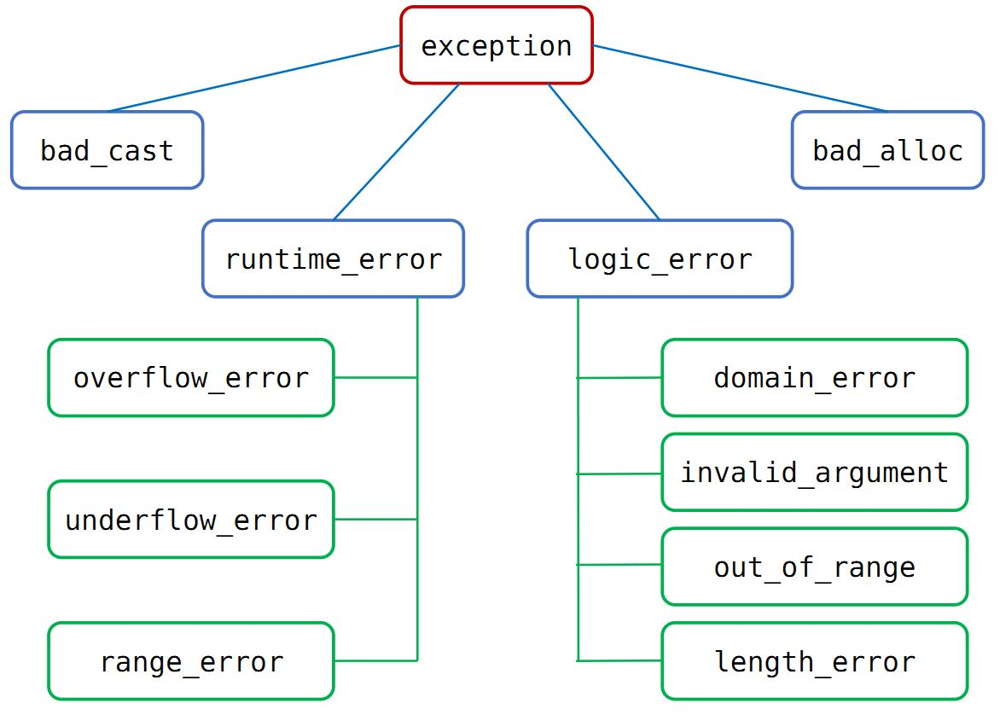

异常
===========

.. highlight:: cpp
  :linenothreshold: 2

异常处理（exception handling）使得我们能够将问题的 **检测** 和 **解决** 过程分离开；程序的一部分负责检测问题的出现，然后解决该问题
的任务传递给程序的另一部分；检测环节无须知道问题处理模块的所有细节，反之亦然。

以下基于 C++ 11 标准。

异常类层次
-------------

标准库异常类的继承体系如下：

头文件
  - ``<exception>`` ：定义了最通用的异常类 exception，它只报告异常的发生，不提供任何额外信息。包括拷贝构造函数、拷贝赋值函数、虚析构函数、what 虚函数。
    what 负责返回一个 const char* 指针，指向一个字符数组，包含了用于初始化异常对象的信息。

    .. code-block:: cpp
      :linenos:

      class exception
      {
      public:
        exception () noexcept;
        exception (const exception&) noexcept;
        exception& operator= (const exception&) noexcept;
        virtual ~exception();
        virtual const char* what() const noexcept;
      }

  - ``<stdexcept>`` ：定义了 runtime_error 和 logic_error 及其派生类。

    - runtime_error：运行时错误，只有在程序运行时才能检测到的错误。

    - logic_error：逻辑错误，在程序代码中发现的错误。

  - ``<new>`` ：定义了 bad_alloc 异常类型。

  - ``<type_info>`` ：定义了 bad_cast 异常类型。

- exception、bad_cast、bad_alloc 定义了默认构造函数。

- runtime_error 和 logic_error 没有默认构造函数，可以接受 C 风格字符串或 string 类型实参的构造函数。初始值蕴含了错误相关的信息。

try 语句块
------------

.. code-block:: cpp
  :linenos:

  try
  {
    // program-statements
    // throw 抛出异常（异常对象拷贝初始化）
  }
  catch (exception-declaration) // 捕捉异常
  {
    // handle-statements
  }
  catch (exception-declaration)
  {
    // handle-statements
  }
  // ...

一个例子：

.. code-block:: cpp
  :linenos:

  #include <iostream>
  #include <stdexcept>
  using namespace std;

  void StringAtI(string str, int i)
  {
    try
    {
      if (str.size() == 0) throw runtime_error("empty string");
      cout << str.at(i) << endl;
    }
    catch (runtime_error &re)
    {
      cout << re.what() << endl; // empty string
    }
    catch (out_of_range &oe)
    {
      cout << oe.what() << endl; // invalid string position
    }
  }

抛出异常
----------

当执行 ``throw`` 之后，跟在 ``throw`` 后面的语句不再执行（类似于 ``return`` 的作用），程序的控制权从 ``throw`` 转移到与之匹配的 ``catch`` 模块。

栈展开
^^^^^^^^^^^^^

栈展开（stack unwinding）过程沿着嵌套函数的调用链不断查找，直到找到了与异常匹配的 ``catch`` 子句为止。

当 ``throw`` 出现在一个 ``try`` 语句块，检测与该块关联的 ``catch`` 子句。如果找到匹配的 ``catch`` ，就是用该 ``catch`` 处理异常。
如果没找到且该 ``try`` 语句嵌套在其他 ``try`` 块中，则继续检查与外层 ``try`` 匹配的 ``catch`` 子句。如果还是找不到，则退出当前函数，在调用当前函数的外层函数中继续寻找。

当找不到匹配的 ``catch`` ，程序将调用标准库函数 ``terminate`` 以中止程序的执行过程。

析构函数与异常
^^^^^^^^^^^^^^^^^^

**析构函数不应该抛出不能被它自身处理的异常** 。换句话说，如果析构函数需要执行某个可能抛出异常的操作，则该操作应该被放置在一个 ``try`` 语句块当中，
并且在析构函数内部得到处理。

析构函数常常仅仅是为了释放资源，因此不太可能抛出异常。

异常对象
^^^^^^^^^^^^^

编译器使用异常抛出表达式对异常对象进行拷贝初始化。

当我们抛出一条表达式时，该表达式的静态编译时类型决定了异常对象的类型。如果 ``throw`` 表达式解引用（ ``*`` ）一个基类指针，而该指针实际指向的是
派生类对象，则抛出的对象只保留了基类部分。

捕获异常
---------------

查找匹配的处理代码
^^^^^^^^^^^^^^^^^^^^^^^^^^

 ``catch`` 中的异常声明的类型决定了处理代码能捕获的异常类型。它可以是左值引用，不能是右值引用。

 通常情况下，如果 ``catch`` 接受的异常与某个继承体系有关，最好将 ``catch`` 的参数定义为引用类型。此时改变了形参，也就改变了异常对象。

 如果多个 ``catch`` 语句的类型之间存在继承关系，应该把继承链最底端的类放在最前面，最顶端的类放在最后面。

重新抛出
^^^^^^^^^^^^^^^

 ``catch`` 语句可以重新抛出异常（rethrowing），将异常传递给另外一个 ``catch`` 语句。重新抛出语句不包含额外的表达式，

 .. code:: cpp

    throw;

空的 ``throw`` 语句只能出现在 ``catch`` 语句或 ``catch`` 直接/间接调用的函数之内，否则编译器将调用 ``terminate`` 。

捕获所有异常
^^^^^^^^^^^^^^

一条捕获所有异常的语句可以和任意类型的异常匹配。通常与重新抛出语句一起使用。

.. code-block:: cpp
  :linenos:

  catch(...)
  {
    // 处理异常
    throw;
  }

noexcept 异常说明
----------------------

通过关键字 ``noexcept`` 指定某个函数不会抛出异常。 ``noexcept`` 紧跟在函数参数列表的后面。

尽管函数声明了不会抛出异常，但是仍然可以抛出异常。一旦 ``noexcept`` 函数抛出了异常，程序就会调用 ``terminate`` 以中止程序。

函数传参与异常传递
-----------------------------------

异常拷贝
^^^^^^^^^^^^^^^^^

用 throw 抛出一个异常到 catch 子句中与通过函数调用传递一个参数有一些相同点，但是他们也存在着巨大的差异。

传递函数参数与异常的途径可以是传值、传引用或传指针，这是相同的。但是当你传递参数和异常时，系统所要完成的操作过程则是完全不同的。
产生这个差异的原因是：你调用函数时，程序的控制权最终还会返回到函数的调用处，但是当你抛出一个异常时，控制权永远不会回到抛出异常的地方。

::

    Widget localW; // 局部异常对象
    throw localW; // 抛出异常

在上例中，不论通过传值捕获异常还是通过引用捕获（不能通过指针捕获这个异常，因为类型不匹配）都将进行 localW 的拷贝操作，也就说传递到 catch 子句中的是 localW 的拷贝。
必须这么做，因为当 localW 离开了生存空间后，其析构函数将被调用。如果把 localW 本身（而不是它的拷贝）传递给 catch 子句，这个子句接收到的只是一个被析构了的 Widget，一个 Widget 的“尸体”，这是无法使用的。
因此 C++ 规范要求被做为异常抛出的对象必须被复制。

对异常对象进行强制复制拷贝，这个限制有助于我们理解参数传递与抛出异常的第二个差异：抛出异常运行速度比参数传递要慢。

当异常对象被拷贝时，拷贝操作是由对象的拷贝构造函数完成的。该拷贝构造函数是对象的静态类型（Static Type）所对应类的拷贝构造函数，而不是对象的动态类型（Dynamic Type）对应类的拷贝构造函数。
也就是说，抛出对象的类型与定义引用或指针的类型相同，而与引用或指针所绑定的对象的类型无关。

::

    DerivedWidget localW; // 派生类对象
    Widget& rw = localW; // 静态类型是 Widget，动态类型是 DerivedWidget
    throw rw; // 抛出对象类型是 Widget
    
捕获异常
^^^^^^^^^^^^^^

捕获异常的方法可以是传值、传引用或传指针。

先说说通过传值捕获：

::

    catch(Widget w)
    
它会建立两个被抛出对象的拷贝，一个是所有异常都必须建立的临时对象，第二个是把临时对象拷贝进 w 中（重要：是两个！）。
而且它会产生 Slicing Problem，即派生类的异常对象被做为基类异常对象捕获时，那它的派生类行为就被切掉了（Sliced Off）。
这样的 sliced 对象实际上是一个基类对象：它们没有派生类的数据成员，而且当本准备调用它们的虚函数时，系统解析后调用的是基类版本。

如果是传引用捕获：

::

    catch(Widget& w)
    catch(const Widget& w)
    
这仍旧会建立一个被抛出对象的拷贝：拷贝同样是一个临时对象。相反当我们通过引用传递函数参数时，没有进行对象拷贝。
传递参数与传递异常的另一个差异是：一个被异常抛出的对象（总是一个临时对象）可以通过普通的引用捕获，它不需要通过常量引用捕获，而在函数调用中不允许传递一个临时对象到一个非常量引用类型的参数里。

通过指针抛出异常与通过指针传递参数是相同的。不论哪种方法都是一个指针的拷贝被传递。但抛出的指针不能是一个指向普通局部对象的指针，因为当异常离开局部变量的生存空间时，该局部变量已经被释放，catch 子句将获得一个指向已经不存在的对象的指针。
该指针指向的对象必须是全局/静态的或者是在堆上的。这避免了捕获一个指向已被释放对象的指针的问题，但是 catch 子句的作者又面临一个令人头疼的问题：他们是否应该删除他们接受的指针？如果是在堆中建立的异常对象，那他们必须删除它，否则会造成资源泄漏。
如果不是在堆中建立的异常对象，他们绝对不能删除它，否则程序的行为将不可预测。所以最好避开使用指针。

.. note::

    如果通过引用捕获异常（Catch By Reference），就能避开上述所有问题：不会为是否删除异常对象而烦恼；能够避开 slicing 异常对象；能够捕获标准异常类型；减少异常对象需要被拷贝的数目。
    所以建议通过引用捕获异常。

异常是其它对象的拷贝，这个事实影响到你如何在 catch 块中再抛出一个异常。
下面两个 catch 块的差别在于第一个 catch 块中重新抛出的是当前捕获的异常，而第二个catch 块中重新抛出的是当前捕获异常的一个新的拷贝。
如果忽略生成额外拷贝的系统开销，这两种方法还有差异么？

::

    catch(Widget& w)
    {
        ...
        throw;
    }
    
    catch(Widget& w)
    {
        ...
        throw w;
    }
    
当然有。第一个块中重新抛出的是当前异常（current exception），无论它是什么类型。特别是如果 w 绑定的是派生类对象，那么第一个块中传递出去的还是派生类异常，即使 w 的静态类型是 Widget。这是因为重新抛出异常时没有进行拷贝操作。
第二个 catch 块重新抛出的是新异常，类型总是 Widget，因为 w 的静态类型是 Widget。一般来说，应该用 ``throw;`` 来重新抛出当前的异常，因为这样不会改变被传递出去的异常类型，而且更有效率，因为不用生成一个新拷贝。

类型转换
^^^^^^^^^^^^^^^^^^

在 catch 子句中进行异常匹配时可以进行两种类型转换。

第一种是派生类与基类间的转换。一个用来捕获基类的 catch 子句也可以处理派生类类型的异常。catch 子句匹配顺序总是取决于它们在程序中出现的顺序，因此一个派生类异常可能被处理其基类异常的 catch 子句捕获，即使同时存在能直接处理该派生类异常的 catch 子句与相同的 try 块相对应。
因此，不要把处理基类异常的 catch 子句放在处理派生类异常的 catch 子句的前面。

第二种是允许从一个类型化指针（Typed Pointer）转变成无类型指针（Untyped Pointer），带有 ``const void*`` 指针的 catch 子句能捕获任何类型的指针类型异常：

::

    catch (const void*) // 捕获任何指针类型异常

参考资料
--------------

1.《C++ Primer 第5版 中文版》 Page 173 -- 176, Page 684 -- 695。

2. C++ reference

  http://www.cplusplus.com/reference/exception/exception

  http://www.cplusplus.com/reference/stdexcept

3. C++ 异常

  https://www.cnblogs.com/nzbbody/p/3418989.html

4. C++ 异常处理

  https://www.runoob.com/cplusplus/cpp-exceptions-handling.html

5. 《More Effective C++》Item M12：理解“抛出一个异常”与“传递一个参数”或“调用一个虚函数”间的差异

6. 《More Effective C++》Item M13：通过引用捕获异常
