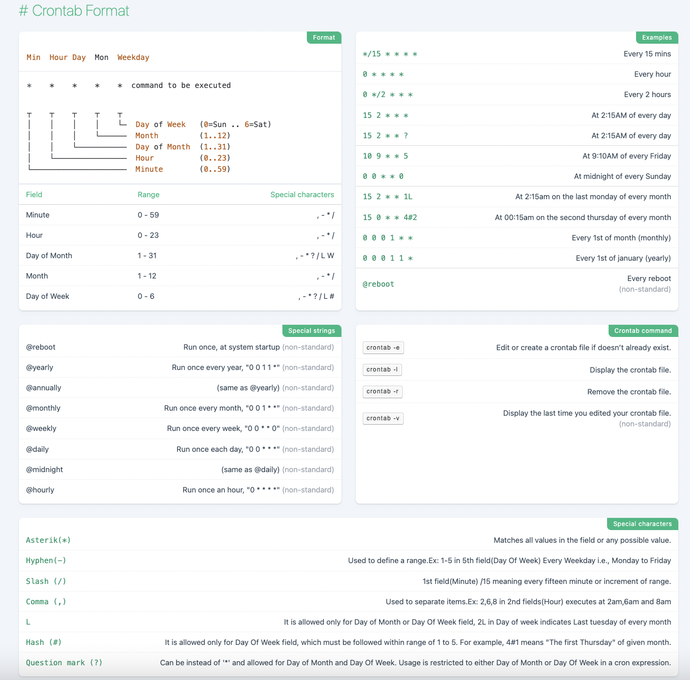

crontab
=================

Linux 的 crontab 用于定时任务调度。

.. attention::

    系统休眠的时候 crontab 定时任务可能不会正确执行。

安装与配置
------------

安装
^^^^^^^^^

.. code:: bash

    apt-get install cron

.. code-block:: bash
    :linenos:

    $ ll /etc | grep cron
    drwxr-xr-x 1 root root   4.0K 2022-11-19 13:19:04 cron.d/
    drwxr-xr-x 1 root root   4.0K 2022-11-19 13:24:23 cron.daily/
    drwxr-xr-x 2 root root   4.0K 2022-11-19 11:45:48 cron.hourly/
    drwxr-xr-x 2 root root   4.0K 2022-11-19 11:45:48 cron.monthly/
    drwxr-xr-x 2 root root   4.0K 2022-11-19 11:45:48 cron.weekly/
    -rw-r--r-- 1 root root   1.1K 2022-11-19 14:38:02 crontab

查看 ``/etc/crontab`` ：

.. code-block:: text
    :linenos:

    # cat /etc/crontab
    # /etc/crontab: system-wide crontab
    # Unlike any other crontab you don't have to run the `crontab'
    # command to install the new version when you edit this file
    # and files in /etc/cron.d. These files also have username fields,
    # that none of the other crontabs do.

    SHELL=/bin/bash
    PATH=/usr/local/sbin:/usr/local/bin:/sbin:/bin:/usr/sbin:/usr/bin

    # Example of job definition:
    # .---------------- minute (0 - 59)
    # |  .------------- hour (0 - 23)
    # |  |  .---------- day of month (1 - 31)
    # |  |  |  .------- month (1 - 12) OR jan,feb,mar,apr ...
    # |  |  |  |  .---- day of week (0 - 6) (Sunday=0 or 7) OR sun,mon,tue,wed,thu,fri,sat
    # |  |  |  |  |
    # *  *  *  *  * user-name command to be executed
    17 *	* * *	root    cd / && run-parts --report /etc/cron.hourly
    25 6	* * *	root	test -x /usr/sbin/anacron || ( cd / && run-parts --report /etc/cron.daily )
    47 6	* * 7	root	test -x /usr/sbin/anacron || ( cd / && run-parts --report /etc/cron.weekly )
    52 6	1 * *	root	test -x /usr/sbin/anacron || ( cd / && run-parts --report /etc/cron.monthly )

该文件配置了 **系统级** 定时任务所使用的环境变量 ``SHELL`` 和 ``PATH``。对于系统级 crontab，在 cron 表达式和命令之间，多了一个 **use-name** 域。

``/etc/crontab`` 还配置了系统级定时任务的执行时间，这些任务放在 ``cron.hourly`` ``cron.daily`` ``cron.weekly`` ``cron.monthly`` 等目录下。

``/etc/cron.d`` 目录也是用来放系统级定时任务，不同的任务写在不同的文件中，定义的时候和 ``/etc/crontab`` 一样也要有 user-name 域。

服务
^^^^^^^^^^^

定时任务依赖 cron 服务。

- 启动服务： ``service cron start``

- 查询服务状态： ``service cron status``

- 停止服务： ``service cron stop``

- 重启服务： ``service cron restart``

指令
^^^^^^^^^^^

.. code:: bash

    crontab [ -u user ] { -l | -r | -e }

- ``crontab -l``

    - 查看定时任务列表。
    - 定时任务保存在文件 ``/var/spool/cron/crontabs/<user-name>`` 。

- ``crontab –e``

    - 编辑定时任务：
  
        .. code:: bash

            * * * * * command
  
    - 定时任务保存在文件 ``/var/spool/cron/crontabs/<user-name>`` 。

- ``crontab –r``

    - 删除定时任务。
    - ``crontab –r -i`` 删除前询问。 

日志
^^^^^^^^^^^^^

首先需要安装并启动 rsyslog 服务：

.. code-block:: bash
    :linenos:

    apt-get install rsyslog
    service rsyslog start

crontab 的日志配置保存在 ``/etc/rsyslog.conf`` 或 ``/etc/rsyslog.d/50-default.conf`` 。
在配置文件中将 cron 对应的那行取消注释：

.. code:: text

    cron.*				/var/log/cron.log

crontab 的日志保存在 ``/var/log/cron.log`` 。

表达式
-------------

.. code-block:: text

    *    *    *    *    *  command to be executed
    ┬    ┬    ┬    ┬    ┬
    │    │    │    │    └─  Day of Week   (0=Sun .. 6=Sat)
    │    │    │    └──────  Month         (1..12)
    │    │    └───────────  Day of Month  (1..31)
    │    └────────────────  Hour          (0..23)
    └─────────────────────  Minute        (0..59)

.. table:: 域和取值范围、可用符号
    :align: center

    ================ ============================= ======================
    Field             Range                        Special characters
    ================ ============================= ======================
    Minute      	  0 - 59	                    ``,`` ``-`` ``*`` ``/``
    Hour	          0 - 23	                    ``,`` ``-`` ``*`` ``/``
    Day of Month      1 - 31	                    ``,`` ``-`` ``*`` ``/`` ``?`` ``L`` ``W``
    Month	          1 - 12	                    ``,`` ``-`` ``*`` ``/``
    Day of Week	      0 - 6	                        ``,`` ``-`` ``*`` ``/`` ``?`` ``L`` ``#``
    ================ ============================= ======================

.. note::

    对于用户级的 crontab，如果定时任务未启动，可能是因为所要执行的命令找不到，因为 crontab 读到的 ``PATH`` 变量不一定与用户的 ``PATH`` 相同，此时应该使用命令的绝对路径，比如 ``/usr/local/bin/python`` 。也可以在命令前定义 ``PATH`` ：

    .. code:: bash

        * * * * * PATH=$PATH:/usr/local/bin; command

    或者使用系统 ``PATH`` ：

    .. code:: bash

        * * * * * . /etc/profile; command

.. attention::

    ``%`` 是 crontab 的关键字符，因此命令中如果包含 ``%`` 需要转义，比如：
    
    .. code:: bash

        * * * * * echo $(date +"\%Y-\%m-\%d \%H:\%M:\%S")

Cheatsheet
---------------

参考资料
---------------

1. Crontab cheatsheet

  https://quickref.me/cron

2. 在线 crontab 表达式

  https://crontab.guru/

3. Why crontab scripts are not working?

  https://askubuntu.com/questions/23009/why-crontab-scripts-are-not-working

4. crontab(5) — Linux manual page

  https://man7.org/linux/man-pages/man5/crontab.5.html