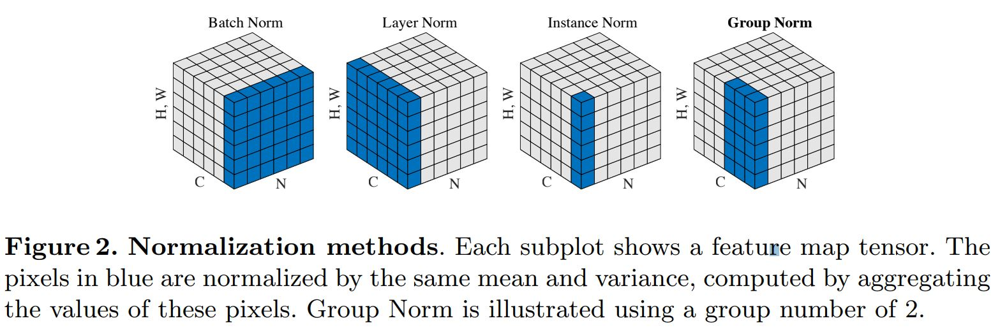

Batch Normalization
============================

.. math::

    \hat{x}^{(k)} &=&\ \frac{x^{(k)} - E[x^{(k)}]}{\sqrt{Var[x^{{(k)}}] + \epsilon}} \\
    y^{(k)} &=&\ \gamma^{(k)} \hat{x}^{(k)} + \beta^{(k)}

加速训练
-------------

- **增大学习率** 。由于网络参数不断更新，导致各层输入的分布不断变化，导致往往需要使用较小的学习率，并精心设计参数初始化。使用BN进行归一化之后，各层输入的分布相同，因此可以使用更大的学习率更快地收敛，并降低网络对初始化的依赖。

- **移除 dropout** 。进行 BN 之后，各样本的 feature map 已经融合了一个 batch 之中其他样本的特性（均值，方差），因此单一样本的影响变小，网络更好学习整体的规律，有效地减小了过拟合的可能性（ BN 提供了正则化的作用）。

- **减小** :math:`L_2` **正则化损失的权重** 。

- **加速学习率衰减** 。

BN消除
-----------

如果网络发现这种 normalization 是多余的，可以通过学习使得：

.. math::

    \gamma^{(k)} &=&\ \sqrt{Var[x^{{(k)}}]} \\
    \beta^{(k)} &=&\ E[x^{(k)}]

从而消除 BN 的作用。

缺点
-----------

BN统计均值、方差与batch size有关，batch size太小会导致性能变差。而某些任务受内存限制，batch size难以设置很大，因此BN作用难以显现。
这时候出现了Group Normalization。

参考资料
-----------

1. Batch Normalization

  https://arxiv.org/pdf/1502.03167.pdf

2. Group Normalization

  http://openaccess.thecvf.com/content_ECCV_2018/papers/Yuxin_Wu_Group_Normalization_ECCV_2018_paper.pdf
