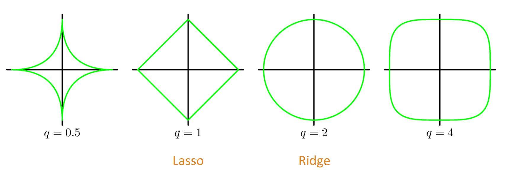

过拟合
===========

复杂的模型将训练数据的抽样误差考虑在内，对抽样误差也进行了拟合。过拟合的模型可以看成是完全记忆型模型。

表现
-----------

训练误差小，测试误差大，泛化能力差。

原因
-----------

- 训练集大小与模型复杂度不匹配；

- 样本的噪声太大甚至掩盖了真实样本的分布规律；

- 训练迭代次数太多（over-training）。

解决方案
-----------

**1**. 调小模型复杂度。

**2**. data augmentation.

**3**. dropout.

**4**. early stopping. 记录观察validation accuracy，及时停止训练。

**5**. 集成学习。Bagging：并行化模型生成，减小模型variance。Boosting：串行化模型生成，减小模型bias。

**6**. 正则化。

    - L0正则化（非0元素个数），难以优化求解（NP-Hard）。

    - L1正则化（元素绝对值之和， Lasso regression），是L0范数的最优凸近似，使权值稀疏。权值稀疏的好处：特征选择 && 可解释性。

    - L2正则化（元素平方和，Ridge regression / weight dacay），使权值分布均匀且值较小。

附：正则化
----------------

.. math::

    L_q\text{-norm}: \ \| w \|^q_q = \sum_j | w_j |^q.

.. image:: ./04_norm2.jpg
  :width: 400px
  :align: center
