快速访问
=============

USTC
-------------

.. hlist::
    :columns: 3

    - .. figure:: pictures/ustc-home.jpeg
         :target: https://ustc.edu.cn
         :width: 160px
         :height: 120px
         :align: center
         
         ustc

    - .. figure:: pictures/ustc-mail.jpeg
         :target: https://mail.ustc.edu.cn
         :width: 160px
         :height: 120px
         :align: center
         
         mail

    - .. figure:: pictures/ustc-lug.jpeg
         :target: https://lug.ustc.edu.cn
         :width: 160px
         :height: 120px
         :align: center
         
         lug

AnyKnew
---------------

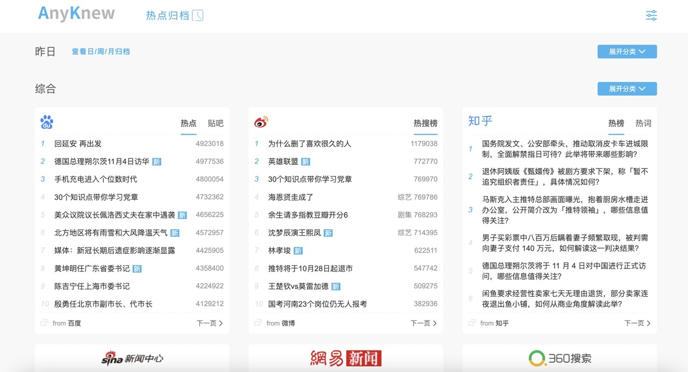

    anyknew

arXiv
-----------

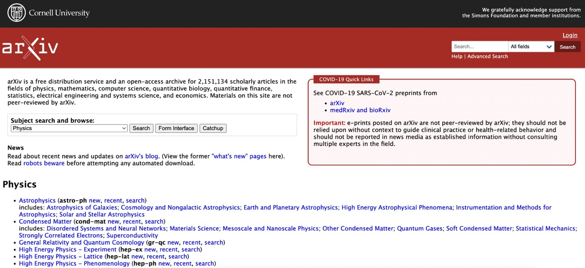

    arxiv

C++ Reference
---------------

.. hlist::
    :columns: 2

    - .. figure:: pictures/cplusplus.jpeg
         :target: http://www.cplusplus.com/reference/
         :width: 160px
         :height: 120px
         :align: center
         
         cplusplus

    - .. figure:: pictures/cppreference.jpeg
         :target: https://en.cppreference.com/w/
         :width: 160px
         :height: 120px
         :align: center
         
         cppreference

Numpy
-----------

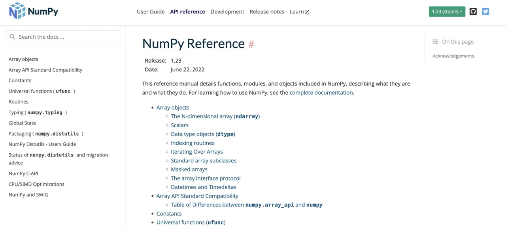

    reference

Pytorch
------------

.. hlist::
    :columns: 2

    - .. figure:: pictures/pytorch-tutorial.jpeg
         :target: https://pytorch.org/tutorials/
         :width: 160px
         :height: 120px
         :align: center
         
         Tutorials

    - .. figure:: pictures/pytorch-doc.jpeg
         :target: https://pytorch.org/docs/master/index.html
         :width: 160px
         :height: 120px
         :align: center
         
         Docs

Hugging Face
---------------

    huggingface

ShareLatex/Overleaf
--------------------------

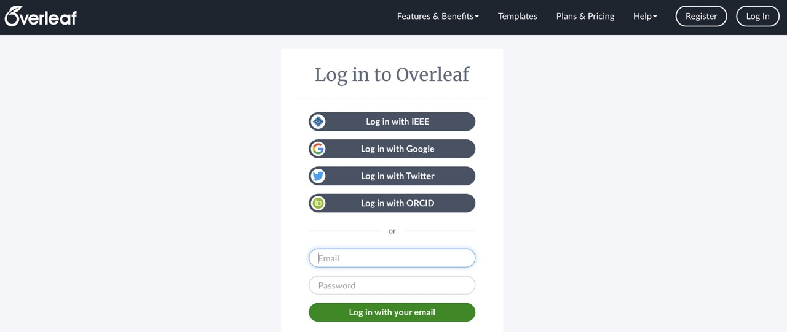
    
    overleaf

在线 LaTex 公式编辑器
---------------------------

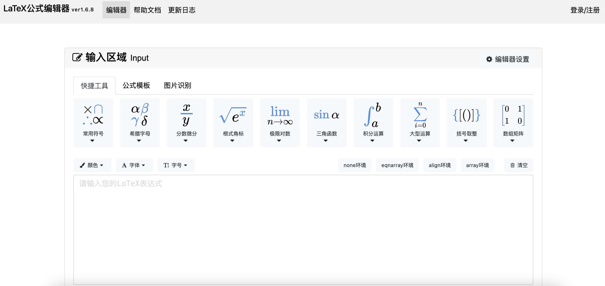
    
    latex

PlanetB
---------

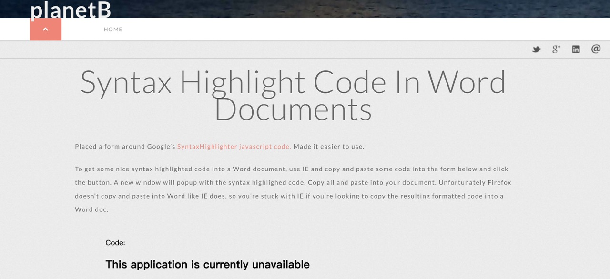
    
    planetb

ANN Search
---------------------------

.. hlist::
    :columns: 2

    - .. figure:: pictures/faiss.jpeg
         :target: https://github.com/facebookresearch/faiss
         :width: 160px
         :height: 120px
         :align: center
         
         faiss

    - .. figure:: pictures/annoy.jpeg
         :target: https://github.com/spotify/annoy
         :width: 160px
         :height: 120px
         :align: center
         
         annoy

C++ Shell
--------------

.. hlist::
    :columns: 2

    - .. figure:: pictures/cpp-shell.jpeg
         :target: http://cpp.sh/
         :width: 160px
         :height: 120px
         :align: center
         
         c++ shell

    - .. figure:: pictures/coliru.jpeg
         :target: http://coliru.stacked-crooked.com/
         :width: 160px
         :height: 120px
         :align: center
         
         coliru

HTTPIE 在线 API 测试
--------------------------

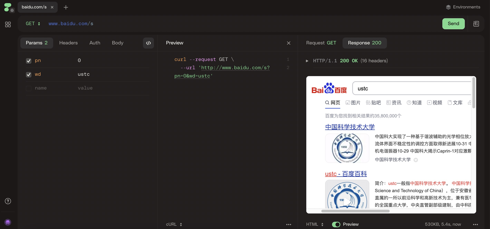
    
    httpie

Json.cn
------------

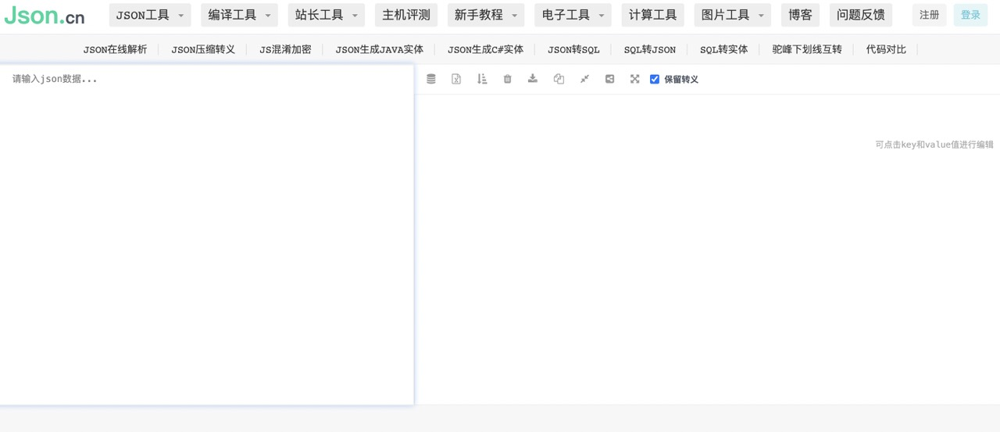
    
    json.cn

在线正则表达式
---------------------------

.. hlist::
    :columns: 2

    - .. figure:: pictures/cn-re.jpeg
         :target: https://c.runoob.com/front-end/854/
         :width: 160px
         :height: 120px
         :align: center
         
         runoob

    - .. figure:: pictures/oschina-re.jpeg
         :target: https://tool.oschina.net/regex
         :width: 160px
         :height: 120px
         :align: center
         
         oschina

Catonmat 在线工具
---------------------------

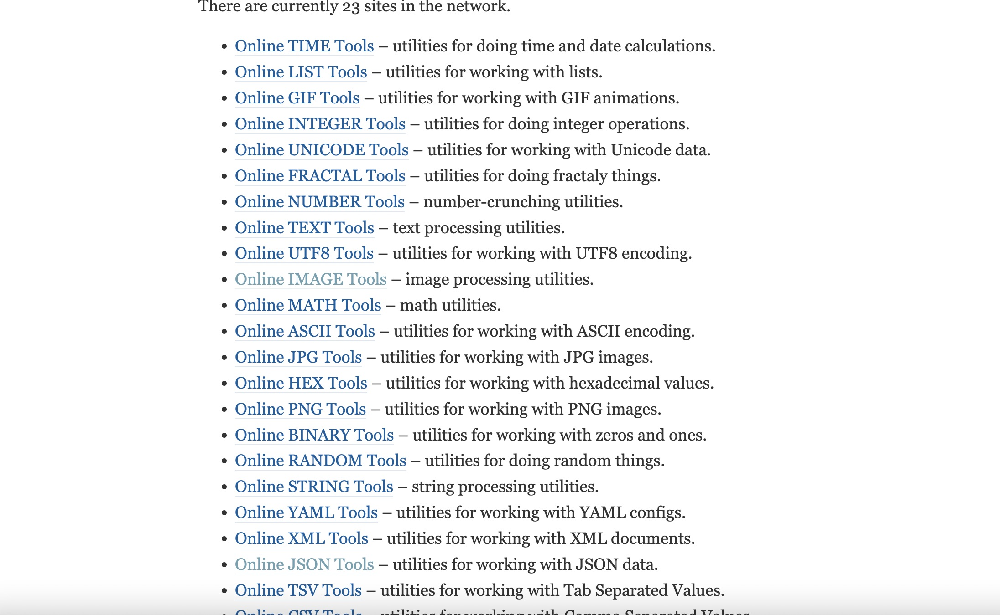
    
    catonmat

Diagram
-----------

.. hlist::
    :columns: 2

    - .. figure:: pictures/diagrams.jpeg
         :target: https://app.diagrams.net/
         :width: 160px
         :height: 120px
         :align: center
         
         diagrams

    - .. figure:: pictures/drawio.jpeg
         :target: https://github.com/jgraph/drawio-desktop
         :width: 160px
         :height: 120px
         :align: center
         
         drawio

重构与设计模式
------------------------

    
    refactoringguru

Docker
------------

.. hlist::
    :columns: 2

    - .. figure:: pictures/docker-docs.jpeg
         :target: https://docs.docker.com/engine/reference/run/
         :width: 160px
         :height: 120px
         :align: center
         
         docker docs

    - .. figure:: pictures/docker-hub.jpeg
         :target: https://hub.docker.com/search?q=&image_filter=official
         :width: 160px
         :height: 120px
         :align: center
         
         docker hub

Curl
---------

.. hlist::
    :columns: 3

    - .. figure:: pictures/curl.jpeg
         :target: https://curl.se/
         :width: 160px
         :height: 120px
         :align: center
         
         curl

    - .. figure:: pictures/curl-man.jpeg
         :target: https://curl.se/docs/manpage.html
         :width: 160px
         :height: 120px
         :align: center
         
         curl manpage

    - .. figure:: pictures/everything-curl.jpeg
         :target: https://everything.curl.dev/
         :width: 160px
         :height: 120px
         :align: center
         
         everything curl

Graphviz
-------------

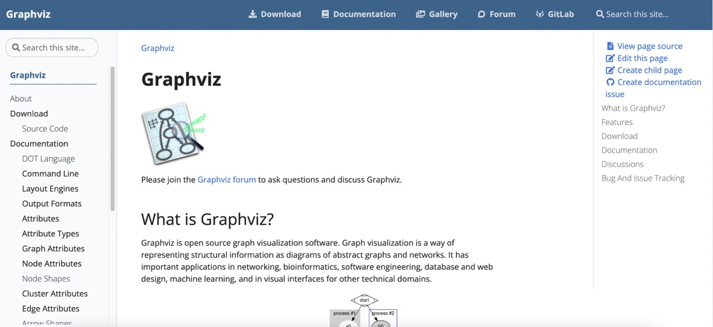
    
    graphviz

Jupyter
-----------------

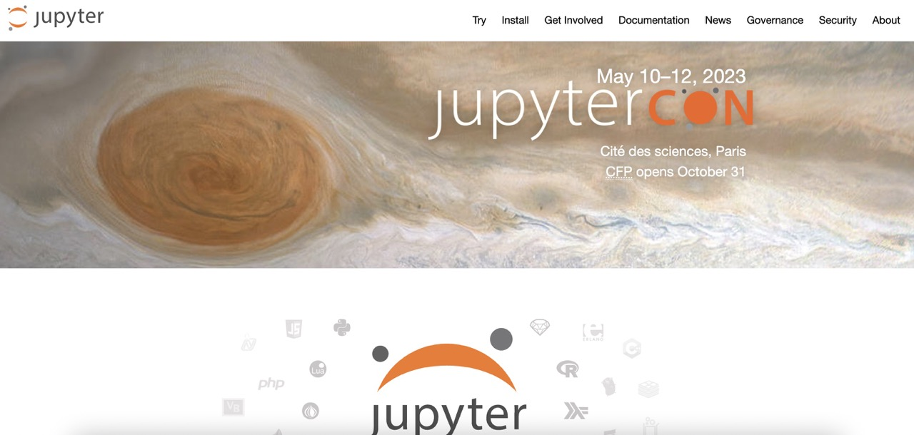
    
    jupyter

Standford University Lectures
-------------------------------

.. hlist::
    :columns: 2

    - .. figure:: pictures/cs229.jpeg
         :target: http://cs229.stanford.edu/
         :width: 160px
         :height: 120px
         :align: center
         
         cs229

    - .. figure:: pictures/cs231.jpeg
         :target: http://cs231n.github.io/
         :width: 160px
         :height: 120px
         :align: center
         
         cs231

Read the Docs
---------------

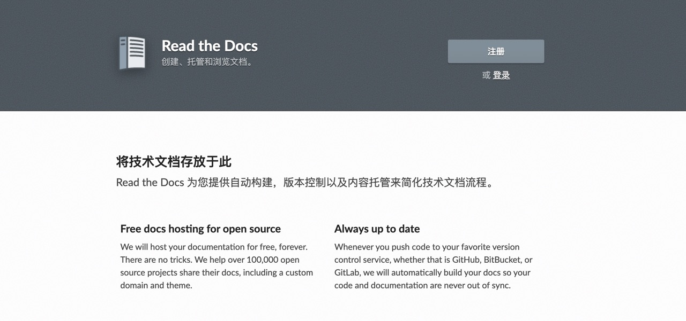

    read the docs

小林 Coding
---------------

.. figure:: pictures/xiaolin.jpeg
    :target: https://xiaolincoding.com
    :width: 160px
    :height: 120px
    :align: center

    xiaolincoding

阮一峰的网络日志
--------------------

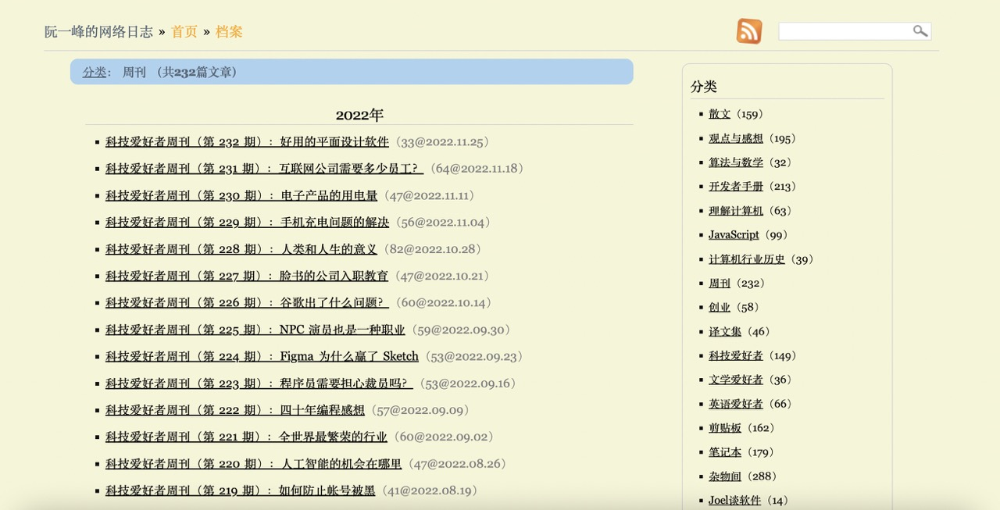

    weekly

Github Page
-------------

    fongyq.github.io