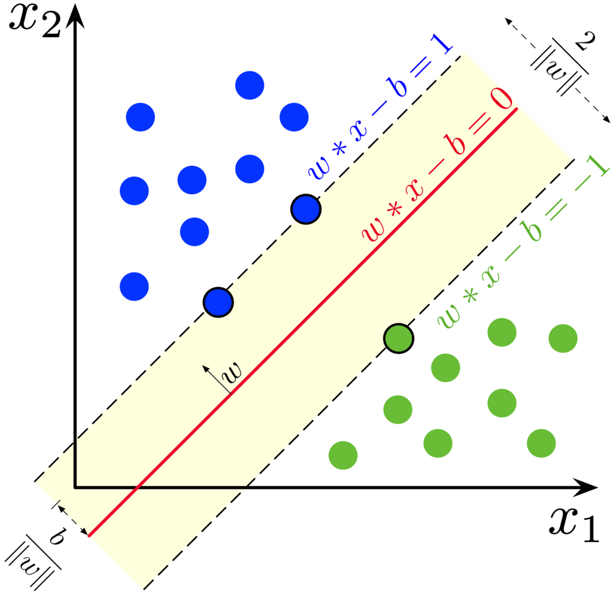

支持向量机
================

最大间隔划分超平面
--------------------

样本空间中任意点到超平面的距离（几何间隔，Geometric Margin）为：

.. math::

  r = \frac{|w^{\top} x + b|}{\| w \|}.

函数间隔（Functional Margin）：

.. math::

  y(w^{\top} x + b).

原始问题：

.. math::

  \underset{w,b}{\mathrm{min}} &\  \frac{1}{2} \left \| w \right \|^2 \\
  \mathrm{s.t.} &\  y_i(w^{\top} x_i + b) \geqslant 1, i=1,2,...,m

拉格朗日函数：

.. math::

  L(w,b,\alpha) = \frac{1}{2}w^{\top}w + \sum_{i=1}^m \alpha_i(1 - y_i(w^{\top} x_i + b))

目标函数：

.. math::

  \underset{w,b}{\mathrm{min}}(\underset{\alpha \geqslant 0}{\mathrm{max}}L(w,b,\alpha))

对偶问题：

.. math::

  \underset{\alpha \geqslant 0}{\mathrm{max}}(\underset{w,b}{\mathrm{min}}L(w,b,\alpha))

令 :math:`L` 对  :math:`w` 和  :math:`b` 的偏导为 0 得：

.. math::

  w &=\ \sum_{i=1}^m \alpha_i y_i x_i,\\
  0 &=\ \sum_{i=1}^m \alpha_i y_i.

对偶问题变成：

.. math::

  \underset{\alpha \geqslant 0}{\mathrm{max}} & \  \sum_{i=1}^m\alpha_i - \frac{1}{2} \sum_{i=1}^m \sum_{j=1}^m \alpha_i \alpha_j y_i y_j x_i^{\top} x_j,\\
  \mathrm{s.t.}  & \  \sum_{i=1}^m \alpha_i y_i = 0,\\
        & \  \alpha_i \geqslant 0, \ i=1,2,...,m.

KKT条件：

.. math::

  y_i(w^{\top} x_i + b) \geqslant 1, \\
  \sum_{i=1}^m \alpha_i y_i = 0,\\
  \alpha_i (1 - y_i(w^{\top} x_i + b)) = 0.

软间隔
------------

引入松弛变量 :math:`\xi_i \geqslant 0` ，用以表征样本不满足约束的程度。

原始问题：

.. math::

  \underset{w,b,\xi_i}{\mathrm{min}} &\  \frac{1}{2} \left \| w \right \|^2 + C \sum_{i=1}^m \xi_i \\
  \mathrm{s.t.} &\  y_i(w^{\top} x_i + b) \geqslant 1 - \xi_i \\
       &\ \xi_i \geqslant 0,\ i=1,2,...,m

拉格朗日函数：

.. math::

 L(w,b,\alpha,\xi,\mu) = \frac{1}{2}w^{\top}w + C \sum_{i=1}^m \xi_i  + \sum_{i=1}^m \alpha_i(1 - \xi_i - y_i(w^{\top} x_i + b)) - \sum_{i=1}^m \mu_i \xi_i

令 :math:`L` 对  :math:`w` ， :math:`b` 和 :math:`\xi_i` 的偏导为 0 得：

.. math::

 w &=\ \sum_{i=1}^m \alpha_i y_i x_i,\\
 0 &=\ \sum_{i=1}^m \alpha_i y_i, \\
 C &=\ \alpha_i + \mu_i.

对偶问题：

.. math::

 \underset{\alpha \geqslant 0}{\mathrm{max}} & \  \sum_{i=1}^m\alpha_i - \frac{1}{2} \sum_{i=1}^m \sum_{j=1}^m \alpha_i \alpha_j y_i y_j x_i^{\top} x_j,\\
 \mathrm{s.t.}  & \  \sum_{i=1}^m \alpha_i y_i = 0,\\
       & \  0 \leqslant \alpha_i \leqslant C, \ i=1,2,...,m.

KKT条件：

.. math::

 y_i(w^{\top} x_i + b) \geqslant 1 - \xi_i, \\
 \sum_{i=1}^m \alpha_i y_i = 0,\\
 \alpha_i (1 - \xi_i - y_i(w^{\top} x_i + b)) = 0, \\
 \xi_i \geqslant 0,\ \mu_i \xi_i = 0, \\
 \alpha_i \geqslant 0,\ \mu_i \geqslant 0.

惩罚因子 :math:`C` ：
  - :math:`C` 太大，导致过拟合（低偏差、高方差）
  - :math:`C` 太小，导致欠拟合（高偏差、低方差）

核函数
------------

核矩阵 :math:`\mathcal{K} = \{ \kappa(x_i, x_j) \} \in \mathbb{R}^{m \times m}` 。

  - 核矩阵对称半正定，:math:`\mathcal{K} \geqslant 0: \forall z,\  z^{\top}\mathcal{K}z \geqslant 0;` :math:`z^{\top}\mathcal{K}z=0` 当且仅当 :math:`z=0` 。

    .. math::

        z^{\top}\mathcal{K}z &=\ \sum_{i=1}^m \sum_{j=1}^m z^{(i)} \kappa(x_i, x_j) z^{(j)} \\
                             &=\ \sum_{i=1}^m \sum_{j=1}^m z^{(i)} \phi(x_i)^{\top} \phi(x_j) z^{(j)} \\
                             &=\ \sum_{i=1}^m \sum_{j=1}^m z^{(i)} \cdot \sum_{k=1}^D \phi^{(k)}(x_i)\phi^{(k)}(x_j) \cdot z^{(j)} \\
                             &=\ \sum_{i=1}^m \sum_{j=1}^m \sum_{k=1}^D z^{(i)} \phi^{(k)}(x_i) \cdot z^{(j)} \phi^{(k)}(x_j) \\
                             &=\ \sum_{k=1}^D \sum_{i=1}^m \sum_{j=1}^m z^{(i)} \phi^{(k)}(x_i) \cdot z^{(j)} \phi^{(k)}(x_j) \\
                             &=\ \sum_{k=1}^D \left( \sum_{l=1}^m z^{(l)} \phi^{(k)}(x_l) \right)^2 \\
                             & \geqslant \ 0.

    其中上标 :math:`(i),(j),(k),(l)` 分别表示向量的第 :math:`i,j,k,l` 维分量。当 :math:`\phi` 维度很高，单独计算 :math:`\phi(x_i)` 和  :math:`\phi(x_j)` 复杂度较高，
    而直接计算 :math:`\kappa(x_i, x_j)` 则简单得多。

  - 常见核函数有：

    - 线性核：:math:`\kappa(x_i, x_j) = x_i^{\top}x_j`
    - 多项式核：:math:`\kappa(x_i, x_j) = (x_i^{\top}x_j)^d`
    - 高斯核：:math:`\kappa(x_i, x_j) = \mathrm{exp}(-\frac{\| x_i - x_j \|^2}{2 \sigma^2})`
    - 拉普拉斯核：:math:`\kappa(x_i, x_j) = \mathrm{exp}(-\frac{\| x_i - x_j \|}{\sigma})`

  - 主要使用线性核，高斯核（RBF）。

  - 当特征维度高且样本少，不宜使用高斯核，容易过拟合。

  - 当特征维度低，且样本够多，考虑使用高斯核。首先需要特征缩放（归一化）。若 :math:`\sigma` 过大，导致特征间差异变小，欠拟合。

多分类
--------

1. 一对一（ :math:`\mathcal{O}(N^2)` ）

2. 一对多（ :math:`\mathcal{O}(N)` ）

3. 使用多分类 Loss

SVM库
-----------

- sklearn
  
- libsvm

优缺点
-------

优点
  - 基于结构风险最小化，泛化能力强（自带正则化， :math:`\left \| w \right \|^2` ）。

  - 它是凸优化问题，可得到全局最优。

  - SVM 在小样本训练集上可得到比其他方法好的结果。

  - 利用核函数，可借助线性可分问题的求解方法，直接求解对应高维空间的问题。

缺点
  - SVM 对缺失特征敏感。

  - 如何确定核函数？

  - 求解问题的二次规划，耗时耗存储。

解析
------

1. 为什么要间隔最大化？

  最优超平面，解唯一，更加鲁棒。

2. 为什么转化为对偶问题？

  - 便于求解（交换 :math:`\alpha` 和 :math:`(w,b)` 位置之后，可直接对 :math:`(w,b)` 求导）。

  - 解的过程可以引入核函数。

SVM 与 LR 的异同
-------------------

相同点：

  - 都是分类算法。

  - 不考虑核函数，分类面都是线性。

  - 都是监督学习算法。

  - 都是判别模型。（判别模型：KNN，SVM，LR；生成模型：HMM，朴素贝叶斯）

不同点：

  - 本质不同：Loss Function不同

  - SVM 只有支持向量影响模型，LR 中每个样本都有作用。

  - SVM 针对线性不可分问题有核函数。

  - SVM 依赖样本间的距离测度，样本特征需要归一化，也就是说 SVM 基于距离，LR 基于概率。

  - SVM 是 **结构风险最小化** 算法（在训练误差和模型复杂度之间的折中，防止过拟合，从而达到真实误差最小化），因为 SVM 自带正则（ :math:`\left \| w \right \|^2` ）。

参考资料
--------------

1. LR与SVM的异同

  https://www.cnblogs.com/zhizhan/p/5038747.html

2. 核函数

  https://www.cnblogs.com/loujiayu/archive/2013/12/19/3481320.html

3. SVM面试题

  https://www.jianshu.com/p/fa02098bc220

4. SVM的优缺点

  https://blog.csdn.net/fengzhizizhizizhizi/article/details/23911699

5. 机器学习技法--SVM的对偶问题

  https://www.jianshu.com/p/de882f0fc434

6. 周志华《机器学习》Page 121 -- 124。

7. Support-vector machine

  https://en.wikipedia.org/wiki/Support-vector_machine#Soft-margin
