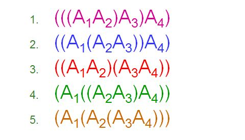
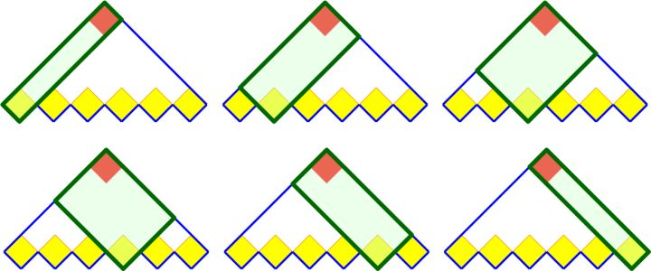
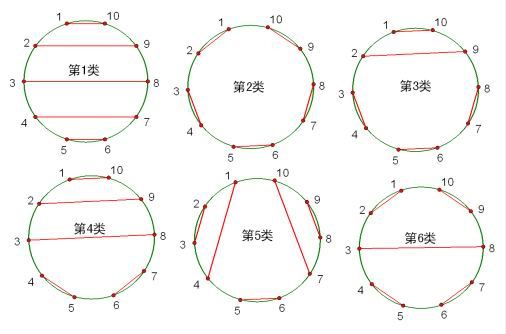

卡特兰数
==============

公式
------------

卡特兰数（Catalan number）的递推式如下：

.. math::

    \mathbb{C}_n & = &\ \mathbb{C}_0 \mathbb{C}_{n-1} + \mathbb{C}_1 \mathbb{C}_{n-2} + \mathbb{C}_2 \mathbb{C}_{n-3} + \cdots + \mathbb{C}_{n-2} \mathbb{C}_1 + \mathbb{C}_{n-1} \mathbb{C}_0 \\
                  & = &\ C_{2n}^n - C_{2n}^{n-1} \\
                  & = &\ \frac{1}{n+1} C_{2n}^n \\
                  & = &\ \frac{1}{n+1} \frac{(2n)!}{n!n!} \\
                  & = &\ \frac{4n-2}{n+1} \mathbb{C}_{n-1} \\

前几项卡特兰数是：

.. math::

    index & : &\  0 &,& 1 &,& 2 &,& 3 &,& 4 &,& 5 &,& 6 &,& 7 &,& 8 &,& 9 &,& 10 &,& 11 &,& 12 &,& 13 &,& 14 &,&  ... \\
    number & : &\ 1 &,& 1 &,& 2 &,& 5 &,& 14 &,& 42 &,& 132 &,& 429 &,& 1430 &,& 4862 &,& 16796 &,& 58786 &,& 208012 &,& 742900 &,& 2674440 &,&  ...

应用
-------------

卡特兰数的应用非常广泛，基本上可以转化为左右匹配的问题，解题最重要的是确定 :math:`n` 的大小。

- 计算矩阵连乘的不同计算次序。
    两个矩阵连乘对应 :math:`\mathbb{C}_1` ，三个矩阵连乘对应 :math:`\mathbb{C}_2` ，四个矩阵连乘对应 :math:`\mathbb{C}_3` 。要求在任一左括号的左边，右括号的数量不多于左括号的数量。

.. image:: ./11_mtree.jpg
  :align: center
  :width: 500 px

- 凸多边形的三角剖分。
    正六边形的剖分对应 :math:`\mathbb{C}_4` 。

- 阶梯形的矩形剖分。
    使用 :math:`n` 个矩形拼成 :math:`n` 阶梯形，对应 :math:`\mathbb{C}_n` 。

- 满位置二叉树（每个节点有0或2个子节点，且左子节点和右子节点是不同的）的计数。
    有 :math:`n` 个叶子节点的满位置二叉树对应  :math:`\mathbb{C}_{n-2}` 。

.. image:: ./11_tree.jpg
  :align: center
  :width: 500 px

- 在 :math:`n \times n` 的格子中，只在下三角行走，每次横或竖走一格，有多少种走法？
    对应 :math:`\mathbb{C}_n` 。要求所有走过的步数中，向右走的步数不比向上走的步数少，即 :math:`C_{2n}^n - C_{2n}^{n-1}` 。

.. image:: ./11_grid.png
  :align: center
  :width: 600 px

- 长度为 :math:`n` 的序列的出栈方式有多少种？
    对应 :math:`\mathbb{C}_n` 。要求进栈的数不少于出栈的数。

- 在圆上选择 :math:`2n` 个点，将这些点成对连接起来使得所得到的 :math:`n` 条线段不相交的方法数。
    对应 :math:`\mathbb{C}_n` 。

- 16个人按顺序去买烧饼，其中8个人每人身上只有一张5块钱，另外8个人每人身上只有一张10块钱。烧饼5块一个，开始时烧饼店老板身上没有钱。16个顾客互相不通气，每人只买一个。这16个人共有多少种排列方法能避免找不开钱的情况出现？
    对应 :math:`\mathbb{C}_8` 。要求队列前方有5块钱的人数不少于有10块钱的人数。

- 12个高矮不同的人，排成两排，每排必须是从矮到高排列，而且第二排比对应的第一排的人高，问排列方式有多少种?
    对应 :math:`\mathbb{C}_6` 。

参考资料
---------

1. 卡特兰数（Catalan number）（二）

  https://zhuanlan.zhihu.com/p/31526354

2. 卡特兰数

  https://www.cnblogs.com/caiyishuai/articles/9047777.html

3. 卡特兰数

  https://www.zybuluo.com/xunuo/note/657512

4. 卡特兰数

  https://www.jianshu.com/p/12c5a161d26d
