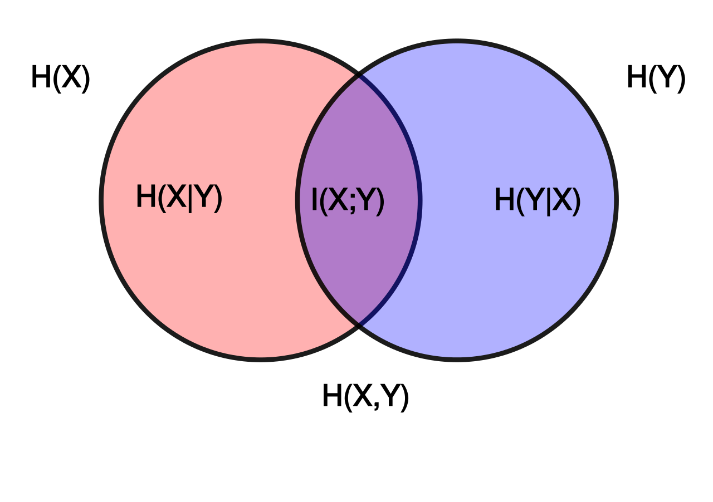
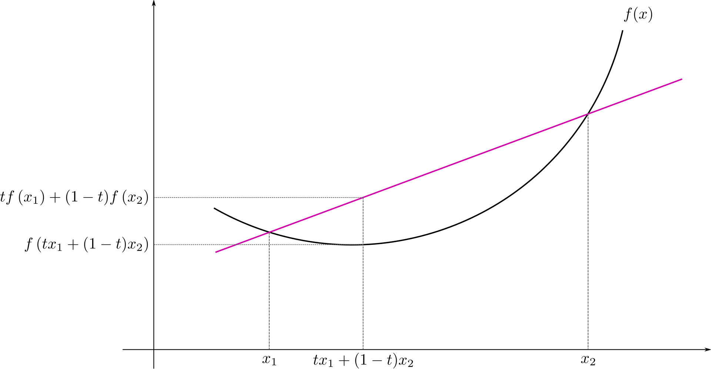

信息熵
============

信息熵
-------------

信息熵：

.. math::

    H(X) & = &\ E[I(X)] = E[-\log (P(X))] \\
         & = &\ - \sum_{i=1}^n P(x_i) \log P(x_i) \ \text{比特/信源符号} \\
         & \geqslant &\ 0

条件熵（给定随机变量 X，对随机变量 Y 仍存在的平均不确定性）：

.. math::

    H(X|Y) = - \sum_{i,j} p(x_i, y_j) \log \frac{p(x_i, y_j)}{p(y_j)}

Differential entropy（连续状态下的熵）：

.. math::

    h(f) & = &\ E[- \log f(x)] \\
         & = &\ - \int f(x) \log f(x) dx

其中 :math:`f(x)` 是概率密度函数（probability density function）。

互信息
------------

.. math::

    I(X, Y) & = &\ \sum_i \sum_j p(x_i, y_j) \log \frac{p(x_i|y_j)}{p(x_i)} \\
            & = &\ H(X) - H(X|Y) \\
            & = &\ H(Y) - H(Y|X) \\
            & = &\ H(X) + H(Y) - H(X,Y) \\
            & = &\ H(X, Y) - H(X|Y) - H(Y|X) \\
            & = &\ I(Y, X) \\
            & \geqslant &\ 0

互信息（mutual information，MI） :math:`I(X, Y)` 总体上表示每传递一个符号所传递的平均信息量，衡量了两个随机变量的独立性。

对于连续变量，将 :math:`H(X)` 替换为 :math:`h(f)` 。

KL 散度
--------------

KL 散度（Kullback–Leibler divergence 或 relative entropy），衡量了两种概率分布的差异性，KL 散度为 0 表示同分布。

.. math::

    D_{KL}(P \| Q) & = &\ - \sum_x P(x) \log \frac{Q(x)}{P(x)}  & & \text{[离散]} \\
                   & = &\ - \int p(x) \log \frac{q(x)}{p(x)} dx  & & \text{[连续]} \\
                   & \geqslant &\ 0 \\
.. math::

    I(X, Y)  =\ D_{KL} ( p(X, Y)\ \| \ p(X)p(Y) )

Jensen's inequality
-------------------------

凸函数
  实数域函数 :math:`f` 是凸函数，满足 :math:`f^{\prime\prime} \geqslant 0` （高维对应 hessian matrix :math:`H \geqslant 0` ）。

Jensen 不等式
  凸函数 :math:`f` ，随机变量 :math:`X` ，则 :math:`E[f(X)] \geqslant f(E[X])` ； :math:`E[f(X)] = f(E[X])` 当且仅当 :math:`X \equiv E[X]` （常数）。

应用
  对任意

  .. math::

      f(x) = - \log x,\ x > 0 \\
      \sum_i p_i = 1,\  0 \leqslant p_i \leqslant 1 \\
      \sum_i q_i = 1,\  0 \leqslant q_i \leqslant 1 \\

  有

  .. math::

      \sum_i p_i f(x_i) \geqslant f(\sum_i p_i x_i),

  即

  .. math::

      \sum_i p_i \log x_i \leqslant \log (\sum_i p_i x_i).

  令

  .. math::

      x_i = \frac{q_i}{p_i} > 0,

  得

  .. math::

      \sum_i p_i \log q_i - \sum_i p_i \log p_i \leqslant \log (\sum_i p_i \frac{q_i}{p_i}) =\ 0,

  即

  .. math::

     - \sum_i p_i \log p_i \leqslant - \sum_i p_i \log q_i.

参考资料
-------------

1. Entropy

  https://en.wikipedia.org/wiki/Entropy\_(information_theory)

2. Mutual information

  https://en.wikipedia.org/wiki/Mutual_information

3. KL divergence

  https://en.wikipedia.org/wiki/Kullback%E2%80%93Leibler_divergence

4. Jensen's inequality

  https://en.wikipedia.org/wiki/Jensen%27s_inequality
