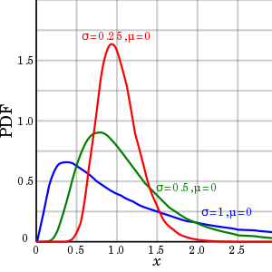

概率基础
===========

贝叶斯公式
------------

.. math::

    P(A|B) = \frac{P(B|A)P(A)}{P(B)}

全概率公式
--------------

.. math::

    P(A) = \sum_i P(A|B_i) P(B_i)

乘法定理
------------

.. math::

    P(AB) &=&\ P(A|B)P(B) = P(B|A)P(A) \\
    P(A_1 A_2 \cdots A_n) &=&\ P(A_1) P(A_2|A_1) P(A_3|A_1 A_2) \cdots P(A_n|A_1 A_2 \cdots A_{n-1})

事件独立
----------

.. math::

    P(AB) &=&\ P(A)P(B) \\
    P(A|B) &=&\ P(A)

容斥定理
-------------

集合：

.. math::

    |A \cup B \cup C| &=&\ |A| + |B| + |C| - |A \cap B| - |A \cap C| - |B \cap C| + |A \cap B \cap C| \\
    \left| \bigcup_{i=1}^n A_i \right| &=&\ \sum_{i=1}^n |A_i| - \sum_{i < j} |A_i \cap A_j| + \sum_{i < j < k} |A_i \cap A_j \cap A_k| + \cdots + (-1)^{n-1} |A_1 \cap A_2 \cap \cdots \cap A_n|

概率：

.. math::

    P(A \cup B \cup C) &=&\ P(A) + P(B) + P(C) - P(A \cap B) - P(A \cap C) - P(B \cap C) + P(A \cap B \cap C) \\
    P \left( \bigcup_{i=1}^n A_i \right) &=&\ \sum_{i=1}^n P(A_i) - \sum_{i < j} P(A_i \cap A_j) + \sum_{i < j < k} P(A_i \cap A_j \cap A_k) + \cdots + (-1)^{n-1} P(A_1 \cap A_2 \cap \cdots \cap A_n)

常见概率分布
--------------

.. table:: 常见概率分布
  :align: center

  ======================  =========================  ===========================================================================================================  =========================================  ===========================================================
        分布                         类型                    概率密度函数（pdf）                                                                                                         均值                              方差
  ======================  =========================  ===========================================================================================================  =========================================  ===========================================================
      伯努利分布                     离散                :math:`p^k (1-p)^{1-k},\ k \in \{ 0,1 \}`                                                                         :math:`p`                             :math:`p(1-p)`
      二项分布                       离散                :math:`C_n^k p^k (1-p)^{n-k}`                                                                                     :math:`np`                             :math:`np(1-p)`
      泊松分布                       离散                :math:`\frac{\lambda^k}{k!}e^{-\lambda}`                                                                         :math:`\lambda`                         :math:`\lambda`
      均匀分布                       连续                :math:`\frac{1}{b-a},\ a \leqslant x \leqslant b`                                                            :math:`\frac{1}{2}(a+b)`                     :math:`\frac{1}{12}(b-a)^2`
      指数分布                       连续                 :math:`\lambda e^{-\lambda x},\ x \geqslant 0`                                                                :math:`\frac{1}{\lambda}`                 :math:`\frac{1}{\lambda ^2}`
      正态分布                       连续               :math:`\frac{1}{\sqrt{2 \pi} \sigma}exp\left( -\frac{(x-\mu)^2}{2\sigma^2} \right)`                            :math:`\mu`                                 :math:`\sigma^2`
      对数正态分布                   连续               :math:`\frac{1}{x}\cdot\frac{1}{\sqrt{2\pi}\sigma}exp\left(-\frac{(\ln x-\mu)^2}{2\sigma^2} \right)`           :math:`e^{\mu + \frac{\sigma^2}{2}}`            :math:`(e^{\sigma^2}-1)e^{2\mu + \sigma^2}`
      拉普拉斯分布                   连续                 :math:`\frac{1}{2b}exp \left( -\frac{|x - \mu|}{b} \right)`                                                   :math:`\mu`                                 :math:`2b^2`
  ======================  =========================  ===========================================================================================================  =========================================  ===========================================================

均值：

.. math::

    E[X] = \int x f(x) dx

方差：

.. math::

    Var[X] = E[X^2] - E^2[X]

中位数：

.. math::

    \int_{-\infty} ^{median} f(x) dx \geqslant \frac{1}{2} \ and \ \int_{median} ^{+\infty} f(x) dx \geqslant \frac{1}{2}.

众数：

.. math::

    mode = argmax \ f(x)

对数正态分布
----------------------

:math:`Y` 服从标准正态分布，则 :math:`X = e^{\mu + \sigma Y}` 服从对数正态分布： :math:`\ln (X) \sim \mathcal{N}(\mu, \sigma^2)` 。

.. math::

    f_X(x) &=&\ \frac{d}{dx} Pr(X \leqslant x) = \frac{d}{dx} Pr(\ln X \leqslant \ln x) \\
           &=&\ \frac{d}{dx} \Phi \left( \frac{\ln x - \mu}{\sigma} \right) \\
           &=&\ \varphi \left( \frac{\ln x - \mu}{\sigma} \right) \frac{d}{dx} \left( \frac{\ln x - \mu}{\sigma} \right) \\
           &=&\ \varphi \left( \frac{\ln x - \mu}{\sigma} \right) \frac{1}{\sigma x} \\
           &=&\ \frac{1}{x}\cdot\frac{1}{\sqrt{2\pi}\sigma}exp\left(-\frac{(\ln x-\mu)^2}{2\sigma^2} \right)

.. math::

    mean =  e^{\mu + \frac{\sigma^2}{2}},\ variance = (e^{\sigma^2}-1) e^{2\mu + \sigma^2},\ median = e^\mu,\ mode = e^{\mu - \sigma^2}.

实例
-----------

- 已知 :math:`X_1, X_2, ..., X_n` 是 :math:`n` 个相互独立同分布随机变量，:math:`F_X(x)` 和 :math:`p_X(x)` 是它们的（累计）分布函数和概率密度函数，分别求其最大值 :math:`Y = max(X_1, X_2, ..., X_n)` 与其最小值 :math:`Z = min(X_1, X_2, ..., X_n)` 的分布函数与概率密度函数。

  解：
    对于 :math:`Y` ：

    .. math::

        F_Y(y) &=&\ P(Y \leqslant y) \\
               &=&\ P(max(X_1, X_2, ..., X_n) \leqslant y) \\
               &=&\ P(X_1 \leqslant y, X_2 \leqslant y, ..., X_n \leqslant y) \\
               &=&\ P(X_1 \leqslant y)P(X_2 \leqslant y) \cdots P(X_n \leqslant y) \\
               &=&\ [F_X(y)]^n
    .. math::

        p_Y(y) = \frac{d}{dy} F_Y(y) = n [F_X(y)]^{n-1} p_X(y)

    对于 :math:`Z` ，同理可得：

    .. math::

        F_Z(z) &=&\ P(Z \leqslant z) \\
               &=&\ 1 - P(Z \geqslant z) \\
               &=&\ 1 - P(X_1 \geqslant z, X_2 \geqslant z, ..., X_n \geqslant z) \\
               &=&\ 1 - [1 - F_X(z)]^n
    .. math::

        p_Z(z) = \frac{d}{dz} F_Z(z) = n [1 - F_X(z)]^{n-1} p_X(z)

    例如，:math:`X_1, X_2, ..., X_n` 均服从区间 :math:`[0, 1]` 的均匀分布，则 :math:`F_X(x) = x,\ p_X(x) = 1` ，有

    .. math::

        p_Y(y) = n y^{n-1},\ E[Y] = \frac{n}{n+1}; \\
        p_Z(z) = n (1-z)^{n-1},\ E[Z] = \frac{1}{n+1}.

- 设 :math:`X, Y` 的联合概率密度函数为 :math:`f_{XY}(x, y)` ，则 :math:`X+Y` 的概率密度函数 :math:`f_Z(z) = \int_x f(x, z-x) dx = \int_y f(z-y, y) dy` 。
  若 :math:`X, Y \sim U(0, 1)` 是相互独立的均匀分布，求 :math:`U = X + Y` 和  :math:`V = X - Y` 的概率密度函数。

  解：
    知 :math:`f_{XY}(x, y) = 1,\ x \in [0,1],\ y \in [0, 1]` 。

    对于 :math:`U` ，

    .. math::
        :nowrap:

        $$
        f_U(u) = \int_{x \in [0,1],\ u-x \in [0,1]} f(x, u-x) dx = \int_{max(0, u-1)}^{min(1, u)} f(x, u-x) dx \\
        =
        \begin{cases}
          u & , & 0 \leqslant u \leqslant 1 \\
          2 - u & , & 1 < u \leqslant 2
        \end{cases}
        $$

    对于 :math:`V` ，设 :math:`Z = -Y \sim U(-1, 0)` ，则 :math:`V = X + Z` ，

    .. math::
        :nowrap:

        $$
        f_V(v) = \int_{x \in [0,1],\ v-x \in [-1,0]} f(x, v-x) dx = \int_{max(0, v)}^{min(1, v+1)} f(x, v-x) dx \\
        =
        \begin{cases}
          1 + v & , & -1 \leqslant v \leqslant 0 \\
          1 - v & , & 0 < v \leqslant 1
        \end{cases}
        $$

参考资料
------------

1. Inclusion–exclusion principle

  https://en.wikipedia.org/wiki/Inclusion%E2%80%93exclusion_principle

2. Log-normal distribution

  https://en.wikipedia.org/wiki/Log-normal_distribution
