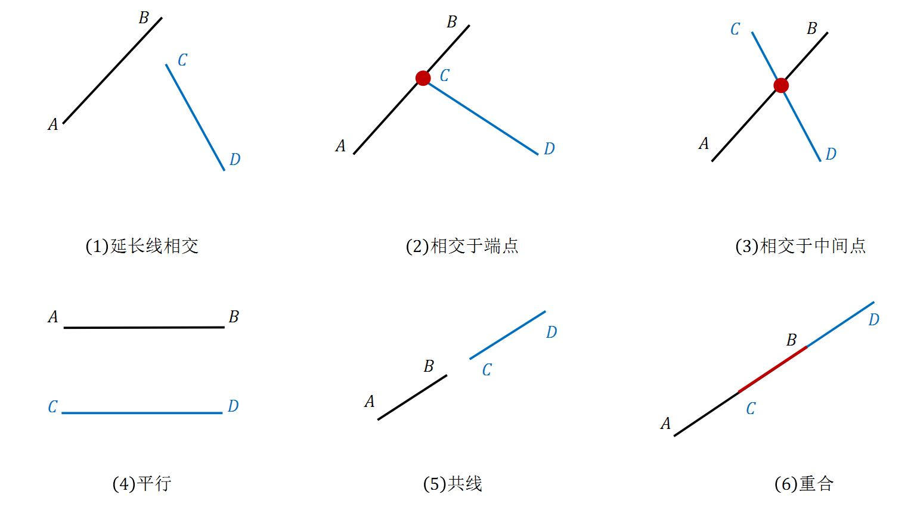
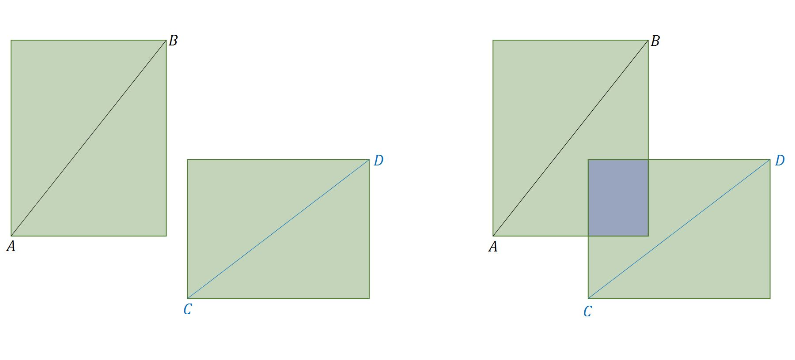
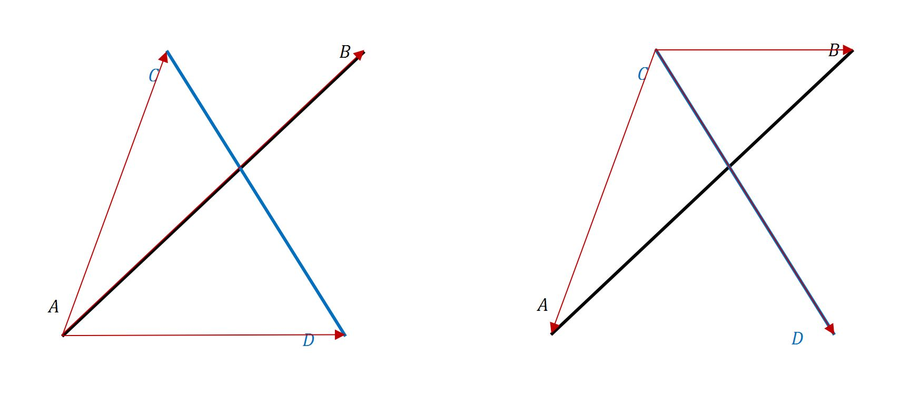

几何
===========

仿射变换
-------------

仿射变换（Affine Transformation）是一个向量空间到另一个向量空间的变换（平移 + 线性变换），变换前后保持以下属性：

- Collinearity ：共线的点仍然共线。

- Parallelism ：平行的线仍然平行。

- Convexity ：凸集仍然是凸集。

- Ratios Of Lengths ：不同线段的长度比值保持不变。

- Barycenters ：点集的重心保持不变。

.. math::
    :nowrap:

    $$
    \begin{bmatrix}
      x^{\prime} \\
      y^{\prime} \\
      1
    \end{bmatrix}
    =
    T
    \begin{bmatrix}
      x \\
      y \\
      1
    \end{bmatrix}
    ,\quad
    T =
    \begin{bmatrix}
      a_1 & a_2 & t_x \\
      a_3 & a_4 & t_y \\
      0 & 0 & 1
    \end{bmatrix}
    $$

恒等变换（Identity）
^^^^^^^^^^^^^^^^^^^^^^^^

.. math::
    :nowrap:

    $$
    T =
    \begin{bmatrix}
      1 & 0 & 0 \\
      0 & 1 & 0 \\
      0 & 0 & 1
    \end{bmatrix}
    $$

平移（Translation）
^^^^^^^^^^^^^^^^^^^^^^^^

.. math::
    :nowrap:

    $$
    T =
    \begin{bmatrix}
      1 & 0 & d_x \\
      0 & 1 & d_y \\
      0 & 0 & 1
    \end{bmatrix}
    $$

缩放（Scaling）
^^^^^^^^^^^^^^^^^^

.. math::
    :nowrap:

    $$
    T =
    \begin{bmatrix}
      s_x & 0 & 0 \\
      0 & s_y & 0 \\
      0 & 0 & 1
    \end{bmatrix}
    $$

当 :math:`s_x=-1` 或 :math:`s_y=-1` 表示翻转（镜像）。

逆时针旋转（Rotation）
^^^^^^^^^^^^^^^^^^^^^^^^^

.. math::
    :nowrap:

    $$
    T =
    \begin{bmatrix}
      \cos \theta & -\sin \theta & 0 \\
      \sin \theta & \cos \theta  & 0 \\
      0 & 0 & 1
    \end{bmatrix}
    $$

错切（Shear）
^^^^^^^^^^^^^^^^^^

.. math::
    :nowrap:

    $$
    T =
    \begin{bmatrix}
      1 & sh_x & 0 \\
      sh_y & 1 & 0 \\
      0 & 0 & 1
    \end{bmatrix}
    $$

线段相交
-------------

**问题** ：给定两条线段四个端点的坐标，判断两条线段是否相交。

方法一：跨立实验
^^^^^^^^^^^^^^^^^^^^^

**快速排斥**

分别以两条线段为对角线作矩形，如果两个矩形没有重合部分（IoU = 0），则两条线段一定不相交。反之不然。

.. code-block:: cpp
  :linenos:

  // 计算重合部分的顶点坐标，可用于计算 IoU
  // rec = {x1, y1, x2, y2} 分别表示矩形左下角和右上角的顶点坐标
  bool isRectangleOverlap(vector<int>& rec1, vector<int>& rec2)
  {
      int left_x = max(rec1[0], rec2[0]);
      int right_x = min(rec1[2], rec2[2]);
      int bottom_y = max(rec1[1], rec2[1]);
      int top_y = min(rec1[3], rec2[3]);
      return (left_x < right_x && bottom_y < top_y);
  }

**跨立实验**

如果两条线段相交，那么：以其中任意一条线段为标准，另一条线段的两个端点一定在这条线段（延长线）的两端，或者在这条线段上。

如果在两端，利用向量叉乘（ `Cross Product <https://en.wikipedia.org/wiki/Cross_product>`_ ）可表示为：

.. math::

  (\overrightarrow{AB} \times \overrightarrow{AC}) \cdot (\overrightarrow{AB} \times \overrightarrow{AD}) < 0,\quad (\overrightarrow{CD} \times \overrightarrow{CA}) \cdot (\overrightarrow{CD} \times \overrightarrow{CB}) < 0.

向量叉乘/向量积
  两个向量 :math:`\vec{a},\vec{b}` 的向量积 :math:`\vec{a} \times \vec{b}` 为一个向量，
  它的方向与 :math:`\vec{a},\vec{b}` 都垂直，且使 :math:`\vec{a},\vec{b}, \vec{a} \times \vec{b}` 构成右手系；
  它的模等于以 :math:`\vec{a},\vec{b}` 为边的平行四边形的面积，即 :math:`|\vec{a} \times \vec{b}| = |\vec{a}||\vec{b}|\sin \theta` ，
  其中 :math:`\theta` 为 :math:`\vec{a},\vec{b}` 的夹角。

  性质：

    .. math::

      \vec{a} \times \vec{b} &=\ - \vec{b} \times \vec{a} \\
      \vec{a} \times \lambda \vec{a} &=\ 0

    .. math::
      :nowrap:

      $$
      \vec{a} \times \vec{b}
       =
      \begin{vmatrix}
        \vec{i} & \vec{j} & \vec{k} \\
        a_1 & a_2 & a_3 \\
        b_1 & b_2 & b_3
      \end{vmatrix}
       =
      \begin{vmatrix}
        a_2 & a_3\\
        b_2 & b_3
      \end{vmatrix}
      \vec{i}
      -
      \begin{vmatrix}
        a_1 & a_3\\
        b_1 & b_3
      \end{vmatrix}
      \vec{j}
      +
      \begin{vmatrix}
        a_1 & a_2\\
        b_1 & b_2
      \end{vmatrix}
      \vec{k}
      $$

      $$
      \begin{vmatrix}
        c_1 & c_2 \\
        c_3 & c_4
      \end{vmatrix}
      =
      c_1 c_4 - c_2 c_3
      $$

  其中 :math:`[O; \vec{i}, \vec{j}, \vec{k}]` 是一个直角坐标系；二维向量的第三维可扩展为 0。

**相交判断**

- :math:`(\overrightarrow{AB} \times \overrightarrow{AC}) \cdot (\overrightarrow{AB} \times \overrightarrow{AD}) > 0` ： :math:`C` 和 :math:`D` 在线段 :math:`AB` 的同一侧

  - 若 :math:`(\overrightarrow{CD} \times \overrightarrow{CA}) \cdot (\overrightarrow{CD} \times \overrightarrow{CB}) = 0` ， :math:`A` 或 :math:`B` 在线段 :math:`CD` 的延长线上，不相交。

  - 若 :math:`(\overrightarrow{CD} \times \overrightarrow{CA}) \cdot (\overrightarrow{CD} \times \overrightarrow{CB}) \neq 0` ，不相交。

- :math:`(\overrightarrow{AB} \times \overrightarrow{AC}) \cdot (\overrightarrow{AB} \times \overrightarrow{AD}) < 0` ： :math:`C` 和 :math:`D` 在线段 :math:`AB` 的不同侧

  - 若 :math:`(\overrightarrow{CD} \times \overrightarrow{CA}) \cdot (\overrightarrow{CD} \times \overrightarrow{CB}) \leqslant 0` ，相交；如果等于 0，交点为 :math:`A` 或 :math:`B` 。

  - 若 :math:`(\overrightarrow{CD} \times \overrightarrow{CA}) \cdot (\overrightarrow{CD} \times \overrightarrow{CB}) > 0` ，不相交。

- :math:`(\overrightarrow{AB} \times \overrightarrow{AC}) \cdot (\overrightarrow{AB} \times \overrightarrow{AD}) = 0` 可能是三种情形：

  - :math:`C` 或 :math:`D` 在线段 :math:`AB` 上（交于 :math:`C` 或 :math:`D` ）。

  - :math:`C` 或 :math:`D` 在线段 :math:`AB` 的延长线上（不相交），此时线段 :math:`CD` 和线段 :math:`AB` 可能是共线。

  - 线段 :math:`CD` 和线段 :math:`AB` 部分重合。

方法二：直线交点方程
^^^^^^^^^^^^^^^^^^^^^

:math:`AB` 的直线方程：:math:`\overrightarrow{OA} + \lambda \overrightarrow{AB}` ，
:math:`CD` 的直线方程：:math:`\overrightarrow{OC} + \mu \overrightarrow{CD}` ，

即：

.. math::
  :nowrap:

  $$
  \begin{cases}
     x &=\ x_a + \lambda (x_b - x_a) \\
     y &=\ y_a + \lambda (y_b - y_a)
  \end{cases}
  $$

  $$
  \begin{cases}
     x &=\ x_c + \mu (x_d - x_c) \\
     y &=\ y_c + \mu (y_d - y_c)
  \end{cases}
  $$

交点方程：

.. math::
  :nowrap:

  $$
  \begin{cases}
    x_a + \lambda (x_b - x_a) &=\ x_c + \mu (x_d - x_c) \\
    y_a + \lambda (y_b - y_a) &=\ y_c + \mu (y_d - y_c)
  \end{cases}
  $$

即：

.. math::
  :nowrap:

  $$
  \begin{cases}
    \lambda (x_b - x_a) - \mu (x_d - x_c) &=\ x_c - x_a \\
    \lambda (y_b - y_a) - \mu (y_d - y_c) &=\ y_c - y_a
  \end{cases}
  $$

若行列式

.. math::
  :nowrap:

  $$
  \Delta
  =
  \begin{vmatrix}
    x_b - x_a & -(x_d - x_c) \\
    y_b - y_a & -(y_d - y_c)
  \end{vmatrix}
   = 0
  $$

表示两线段重合或平行。

若 :math:`\Delta \neq 0` ，利用 `Cramer 法则 <https://en.wikipedia.org/wiki/Cramer%27s_rule>`_ 求出：

.. math::
  :nowrap:

  $$
  \lambda
  =
  \frac{1}{\Delta}
  \begin{vmatrix}
    x_c - x_a & -(x_d - x_c) \\
    y_c - y_a & -(y_d - y_c)
  \end{vmatrix}
  $$

  $$
  \mu
  =
  \frac{1}{\Delta}
  \begin{vmatrix}
    x_b - x_a & x_c - x_a \\
    y_b - y_a & y_c - y_a
  \end{vmatrix}
  $$

只有当 :math:`0 \leqslant \lambda \leqslant 1,\ 0 \leqslant \mu \leqslant 1` 两条线段才相交，否则交点在线段的延长线上。

凸多边形
--------------

**问题** ：按逆时针顺序给定多边形 :math:`n` 个顶点的坐标，判断该多边形是否是凸多边形。

**方案** ：凸多边形的特点是：对于任意一条边，其他的边都在它的同一侧；按逆时针顺序，下一条边 :math:`\vec{l}_{i+1}` 一定在当前边 :math:`\vec{l}_i` 的逆时针方向。
判断方法：如果 :math:`\vec{l}_i \times \vec{l}_{i+1}` 符号为正，则在逆时针方向；符号为负，则在顺时针方向；大小为 0，表示平行/共线。

参考资料
-------------

1. 计算几何-判断线段是否相交

  https://www.cnblogs.com/wuwangchuxin0924/p/6218494.html

2. 线段的交点计算

  http://dec3.jlu.edu.cn/webcourse/t000096/graphics/chapter5/01_1.html

3. 何为仿射变换(Affine Transformation)

  https://www.cnblogs.com/bnuvincent/p/6691189.html

4. Affine transformation

  https://en.wikipedia.org/wiki/Affine_transformation#Properties
