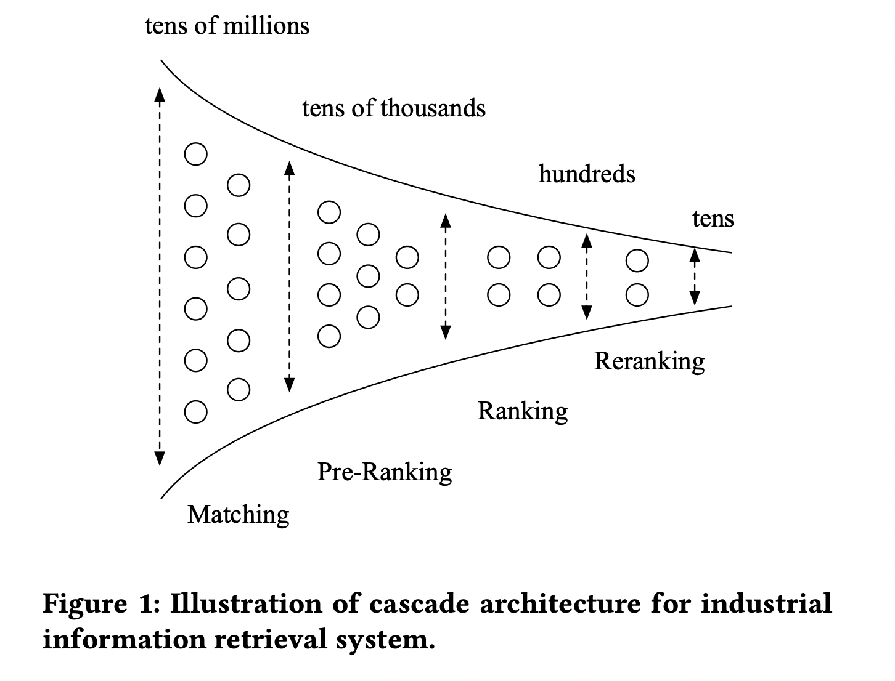

概述
============

架构
-----------

一个大型的工业级排序系统都会采用多阶段的排序架构（像一个很大的漏斗），通常会包含四部分：召回、粗排、精排和重排。
以阿里巴巴定向广告为例，召回的规模一般是千万左右，而粗排打分规模一般是一万以上，精排和重排的规模一般是上百左右。
粗排是处于召回和精排的一个中间阶段，目标是在满足算力 RT 约束的情况下，从上万个广告集合中选择满足后链路需求的候选广告集合。

- 召回是源头，在某种意义上决定着整个推荐的天花板，召回需要快、覆盖广；

- 粗排是初筛，一般不会上复杂模型（本质上是精排模型在线上 Serving 时延要求下的折中）；

- 精排决定最终推荐精度，在特征和模型上都会做的比较复杂；

- 重排一般是做打散或满足业务运营的特定强插需求。

参考资料
-------------

1. 阿里粗排技术体系与最新进展

  https://www.6aiq.com/article/1613987373768

2. 推荐算法召回-粗排-精排链路总结

  https://zhuanlan.zhihu.com/p/463021052

3. 推荐系统[四]：精排-详解排序算法LTR (Learning to Rank)

  https://www.cnblogs.com/ting1/p/17166976.html

4. 推荐系统技术演进趋势：从召回到排序再到重排

  https://zhuanlan.zhihu.com/p/100019681

5. 推荐系统的架构-冷启动-召回-粗排-精排-重排

  https://zhuanlan.zhihu.com/p/572998087

6. Deep Neural Networks for YouTube Recommendations

  https://static.googleusercontent.com/media/research.google.com/zh-CN//pubs/archive/45530.pdf

7. Real-time Personalization using Embeddings for Search Ranking at Airbnb

  https://raw.githubusercontent.com/wzhe06/Ad-papers/master/Embedding/%5BAirbnb%20Embedding%5D%20Real-time%20Personalization%20using%20Embeddings%20for%20Search%20Ranking%20at%20Airbnb%20(Airbnb%202018).pdf

8. COLD: Towards the Next Generation of Pre-Ranking System

  https://arxiv.org/pdf/2007.16122.pdf

