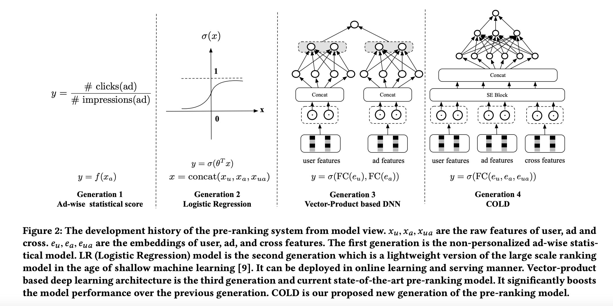
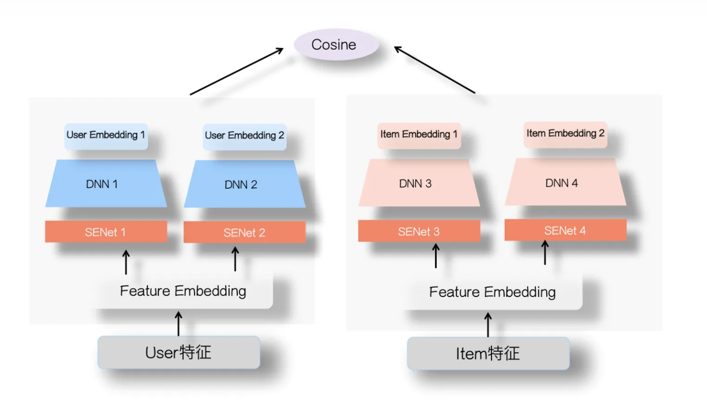
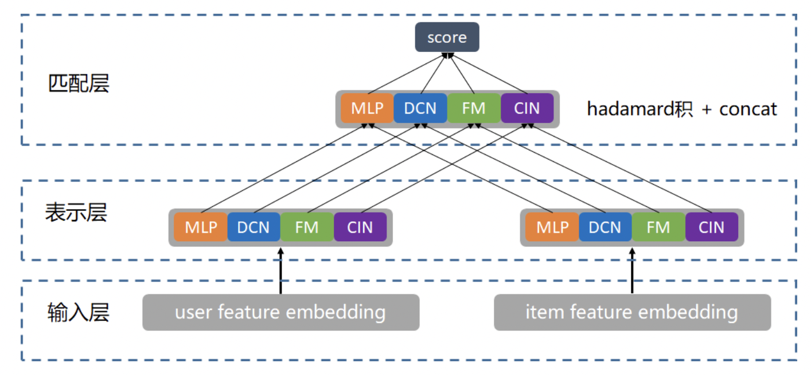
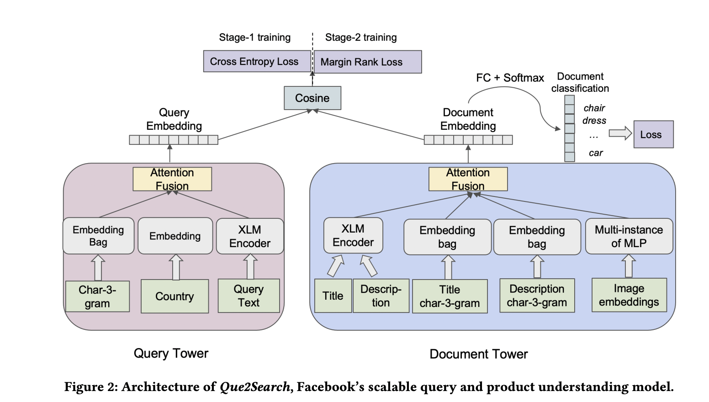

粗排
============

粗排像是精排和召回的一个折中点，它也需要速度的保证，但是并不需要召回那么快，因为经过召回层的筛选，其面对的 Item 量已经被大大的衰减。
但是，精度相对来说要求就要比召回要更准了，不过因为后面还有一个精排层，所以也不用特别精准。
因此粗排层更像是一个召回和精排的折中，其更像一个精排的影子，但速度是强于精排的。

综上，粗排和精排有两点不同：

- **算力和 RT 的约束更严格**：粗排的打分量远高于精排，同时有更严格的延迟约束。

- **解空间问题更严重**：粗排和精排训练的时候使用的都是展现样本，但是线上打分环节粗排打分候选集更大，打分阶段距离展现环节更远，因此粗排阶段打分集合的分布和展现集合差距相比精排更大，解空间问题也更严重。

发展历程
-------------

- 第一代粗排是静态质量分。
- 第二代粗排是以 LR 为代表的早期机器学习模型，模型结构比较简单，有一定的个性化表达能力，可以在线更新和服务。
- 当前应用最广泛的第三代粗排模型，是基于向量内积的深度模型，一般为双塔结构。
- 第四代 `COLD <https://arxiv.org/pdf/2007.16122.pdf>`_ ：算力感知的在线轻量级的深度粗排系统，特征深度交叉。

双塔
-----------

基础双塔
^^^^^^^^^^^^^

粗排的双塔和召回的双塔在训练和部署的时候模式是很像的；在做离线向量化的时候，由于候选集合已经大大缩小，因此可以直接用 KV 表存储 Item 向量。

双塔向量内积模型相比之前的粗排模型，表达能力有了很显著的提升，其优点：

- 内积计算简单，节省线上打分算力。
- Item 向量离线计算产出（User 向量也可以离线产出），缓解在线 RT 问题。

缺点在于：

- 模型表达能力仍然受限：向量内积虽然极大的提升了运算速度，节省了算力，但是也导致了模型无法使用交叉特征，能力受到极大限制。
- 模型实时性较差：因为 Item 向量一般需要提前计算好，而这种提前计算的时间会拖慢整个系统的更新速度，导致系统难以对数据分布的快速变化做出及时响应
- 迭代效率：User 向量和 Item 向量的版本同步影响迭代效率。
- 存在冷启动问题，对新 Item、新 User 不友好。

改进双塔
^^^^^^^^^^^^^

双塔最大的缺点就在于，User & Item 两侧信息交叉得太晚，等到最终能够通过 Dot 或 Cosine 交叉的时候，User & Item Embedding 已经是高度浓缩的了，一些细粒度的信息已经在塔中被损耗掉，永远失去了与对侧信息交叉的机会。
所以，双塔改建最重要的一条主线就是：如何保留更多的信息在 Final Embedding 中，从而有机会和对侧塔得到的 Embedding 交叉。

`SENet双塔模型 <https://zhuanlan.zhihu.com/p/358779957>`_
    在将信息喂入塔之前，插入 `SEBlock <https://openaccess.thecvf.com/content_cvpr_2018/papers/Hu_Squeeze-and-Excitation_Networks_CVPR_2018_paper.pdf>`_ ，动态学习各特征的重要性，增强重要信息，弱化甚至过滤掉原始特征中的噪声，从而减少信息在塔中传播过程中的污染与损耗，能够让可能多的重要信息“撑”到最后交叉那一刻。参考 `FiBiNet <https://arxiv.org/pdf/1905.09433.pdf>`_ 。

`并联双塔 <https://mp.weixin.qq.com/s/karPWLyHITu-qZceEhpn-w>`_ 
    通过并联多个双塔结构增加双塔模型的宽度，来缓解双塔内积的瓶颈从而提升效果。

`大塔拆小塔 <https://scontent-nrt1-1.xx.fbcdn.net/v/t39.8562-6/246795273_2109661252514735_2459553109378891559_n.pdf?_nc_cat=105&ccb=1-7&_nc_sid=e280be&_nc_ohc=gMGpX_QRxVQAX8sB4We&_nc_ht=scontent-nrt1-1.xx&oh=00_AfClf52n940nIgKU1T1AZ5Rf2qM60MPlXcXPYYU1paIdDA&oe=6581D023>`_ 
    拆一个大塔为若干小塔，不同信息通过不同通道向上传递，使用 Attention Fusion 融合多塔 Embedding 生成 Final Embedding。

.. note::

    在满足 RT 的条件下，在线可以把 User 向量和 Item 向量串起来再过一层 DNN 进行交叉。

还有一种方式是让粗排模型对精排模型 **蒸馏** 。
具体做法是用精排模型的打分作为一个 Soft Label，用 KL 散度或者 MSE 去建立精排打分和粗排模型打分的损失函数，让粗排模型更好的拟合精排的分布。

`Google 还提出使用对比学习来训练双塔模型 <https://arxiv.org/pdf/2007.12865.pdf>`_ ，使用 Masking + Dropout 对 Item 侧的特征进行 Augmentation。

负样本
---------

此阶段可以用曝光未点击样本作为负样本去拟合精排，不再那么需要负样本采样。
另外，为了可以更贴近精排的分布，可以采用精排打分的前 N 个样本作为正样本，或者精排打分的后 N 个样本作为负样本加入训练样本。
这么做的原因是，精排打分前 N 是精排认为特别好的样本，可以作为一个伪正样本，增强粗排辨别精排所喜欢的样本的能力；精排打分后 N 作为负样本，主要是让粗排知道这些并不是精排喜欢的样本，以后不要再送过来了。

参考资料
-------------

1. 阿里粗排技术体系与最新进展

  https://www.6aiq.com/article/1613987373768

2. 久别重逢话双塔

  https://zhuanlan.zhihu.com/p/428396126

3. 推荐系统的架构-冷启动-召回-粗排-精排-重排

  https://zhuanlan.zhihu.com/p/572998087

4. “并联”双塔模型 | 你还不知道怎么玩吗！

  https://mp.weixin.qq.com/s/karPWLyHITu-qZceEhpn-w

5. 张俊林：推荐系统排序环节特征 Embedding 建模
   
  https://www.6aiq.com/article/1665572839066