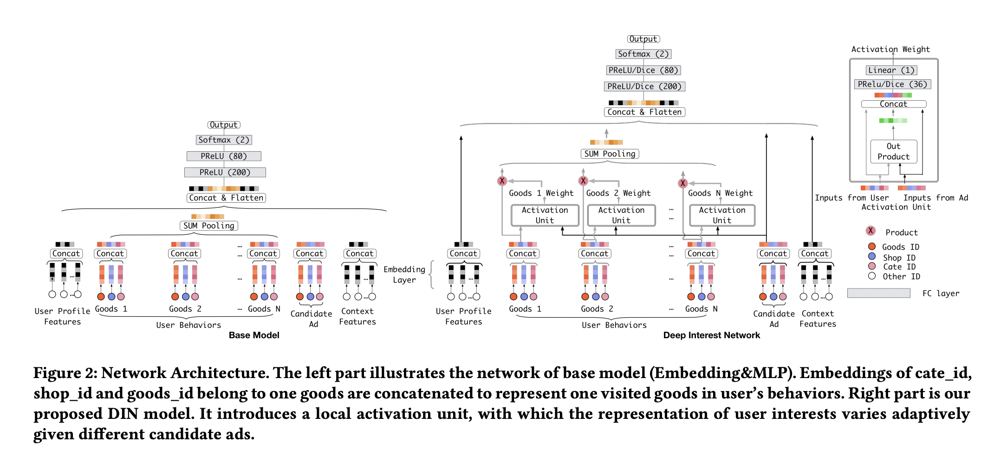
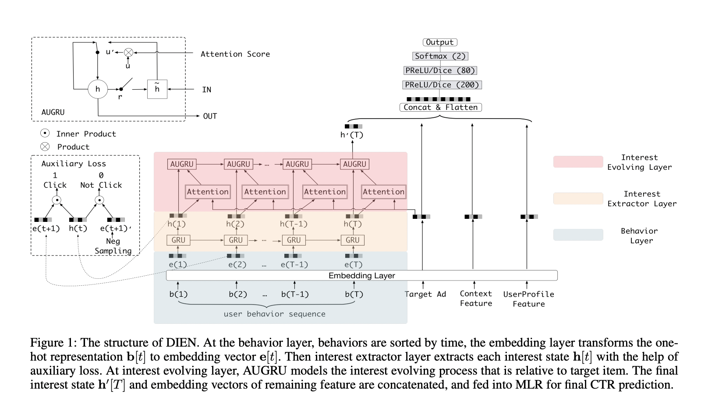
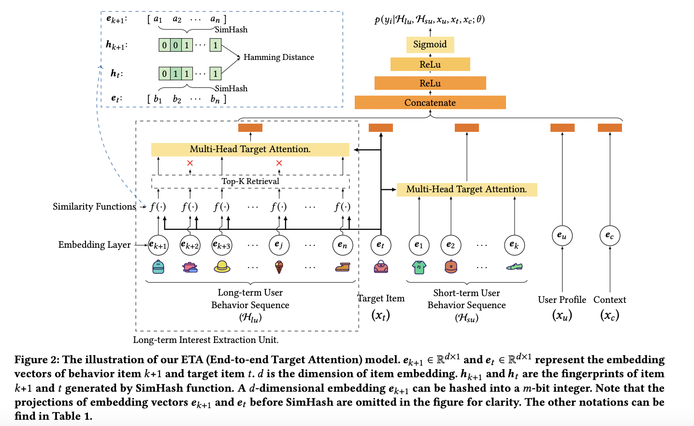
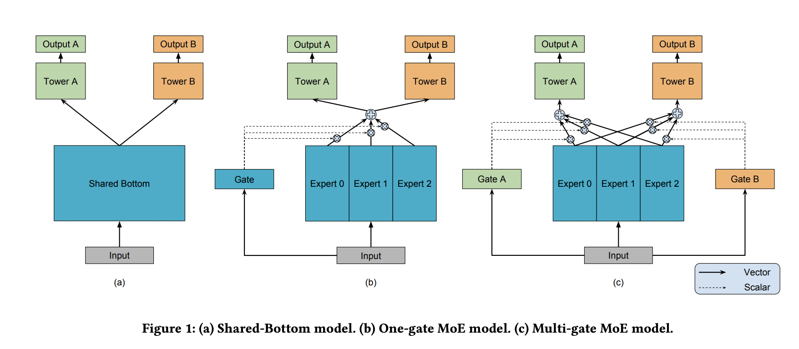

精排
============

.. image:: ./04_models.png
    :width: 900px
    :align: center

精排其实是推荐系统最重要的一环，直接表现了用户个性化的优劣与否，好的精排模型直接决定了用户的留存和转化，因为其推出的 Item 就直接代表了用户的兴趣点。如果精排模型出现差错，直接的表现就是点击率大幅下降，用户将逐渐流失，转化也会逐渐减少，因此精排是非常重要的一环。

最初的推荐系统并不存在冷启动、召回、粗排和重排，仅仅只有一层精排，CF 就是最早的精排模型，这时候仅仅只考虑用户和 Item 的点击共现关系，后面 LR 的出现开始在各大公司大行其道，其中的优秀代表作就是百度的大规模特征工程 + LR，其主要作用就是将 User 的基础特征和 Item 的基础特征提取出来，加上大量的人造特征提取 User 和 Item 的共性，然后运用梯度下降让模型去学习 User 和 Item 的关系，其主要优点就是速度快，缺点是需要大量的特征工程去堆砌和实验。
2014 年，基于树模型的 GBDT 开始被广泛应用于市场，因为其对于连续特征的处理的优秀能力，其经常被用来作为连续特征的提取器提取叶子特征，供给 LR 使用。
之后精排开始进入深度学习时代，特征开始进 Embedding 化，模型也出现了几个不同的优化分支：第一个分支是模型侧的特征交叉，主要的代表作有 FM、FFM、DeepFM、DCN、DCNv2、Fibinet 等；
第二个分支是序列特征的兴趣提取，主要代表作有 DIN、DIEN、SIM 等；第三个分支是多目标模型的研究，主要代表作有 ESSM、MMOE、SNR 和 PLE 等。

特征
--------

- **Context 特征** ：时间、场景、操作系统等
- **User 特征** ：
  
  - 静态特征：年龄、性别、城市等
  - 统计特征：最近 7 天的 PV、CTR、CVR等
  - 行为序列：点击/购买/收藏等
  
- **Item 特征** ：
  
  - 静态特征：类目、品牌等
  - 统计特征：最近 7 天的 PV、CTR、CVR等
  - 交叉特征：与 User 特征的 Hit/Trigger 编码等

.. note::

    对序列特征的处理一般是 Sum/Mean Pooling 或者 Attention（DIN/DIEN/BST）等。
    
    特征重要性：可以在网络 Embedding 层之后加一层 L1 Layer，为每个特征分配一个权重，Loss 中加入这些权重对应的 L1 Loss。

交叉模型
-----------

`Wide & Deep <https://arxiv.org/pdf/1606.07792.pdf>`_
^^^^^^^^^^^^^^^^^^^^^^^^^^^^^^^^^^^^^^^^^^^^^^^^^^^^^^^^^^^^^^^^^^^^^^^^^^^^^^^^^

Wide & Deep 模型分为 Wide 侧和 Deep 侧两部分。Wide 侧利用复杂的人工交叉特征去提高"记忆"能力，一般是 LR 模型或者 FM 模型；在 Deep 侧引入 DNN 让模型具有自动交叉组合的能力从而提高泛化性。

“记忆”能力可以理解为模型直接学习并利用历史数据中物品或特征的“共现频率”的能力。简单的模型能够让原始输入数据更直接地影响输出结果，相当于模型记住了历史数据的分布特点。

“泛化”能力可以理解为模型传递特征的相关性、发掘稀疏甚至从未出现过的稀有特征与最终标签相关性的能力。深度神经网络通过特征的多次自动组合，可以深度发掘数据中潜在的模式，得到较为稳定、平滑的推荐概率。

Wide 侧的交叉特征仍然需要精心设计， Wide 侧和 Deep 两部分模型的超参协同调优也很关键。

.. image:: ./04_wideDeep.png
    :width: 400px
    :align: center

`DeepFM <https://arxiv.org/pdf/1703.04247.pdf>`_
^^^^^^^^^^^^^^^^^^^^^^^^^^^^^^^^^^^^^^^^^^^^^^^^^^^^^^^^^^^^^^^^^^^

DeepFM 是 Deep 与 FM 结合的产物，也是 Wide & Deep 的改进版，只是将其中的 LR 替换成了 FM，提升了模型 Wide 侧特征组合的能力。
Deep 与 FM 这两个部分的输入是一样的，并没有像 Wide & Deep 模型那样做区分。

FM 有两部分：线性部分和二阶交叉部分。线性部分给予每个特征一个权重，然后加权求和；交叉部分是对特征进行两两相乘，然后加权求和。两部分结果累加在一起即为 FM 侧的输出。

实际应用中，FM 侧不一定要对所有特征做交叉，这里也可以人工归类一些特征组，然后对这些特征组的均值 Embedding 做交叉。

.. image:: ./04_deepFM.png
    :width: 400px
    :align: center

.. note::

    Embedding 层的作用是将稀疏（Sparse）特征转换成稠密（Dense）向量，其参数量非常巨大，且由于输入特征过于稀疏，因此 Embedding 层是收敛速度很慢。

序列建模与 Attention
------------------------------

`DIN <https://arxiv.org/pdf/1706.06978.pdf>`_
^^^^^^^^^^^^^^^^^^^^^^^^^^^^^^^^^^^^^^^^^^^^^^^^^^^^^^^^^^^^^^^^^^^^^^^^

出发点：

- Diversity：在一段时间内，用户的点击兴趣具有多样性。

- Local Activation：尽管用户的兴趣很多，但是只有部分行为兴趣对当前的点击产生作用。

其做法是对序列 ID Embedding 加入 Target Attention。

.. note::

    `Self Attention 和 Target Attention <https://www.zhihu.com/question/473208103/answer/2663109954>`_
        在推荐领域，两者的区分可以简单理解为：Q、K、V 是否来自相同的特征。当 Q、K、V 均来自相同特征时，则为 Self Attention，反之则为 Target Attention。
        在精排模型中，基本采用 Target Attention ，将当前 Item 作为 Q，用户历史行为序列作为 K 和 V。
        也有一些模型应用时无法采用 Target Attention，比如双塔模型 User 和 Item 侧是分开的，无法在某一侧的模型结构中同时获得 Item 和用户行为历史，此时则可采用 Self Attention。

`DIEN <https://arxiv.org/pdf/1809.03672.pdf>`_
^^^^^^^^^^^^^^^^^^^^^^^^^^^^^^^^^^^^^^^^^^^^^^^^^^^^^^^^^^^^^^^^^^^^^^^^

DIEN 解决的是用户兴趣迁移的问题。用户的兴趣通常随着时间的流逝会发生变化，直接用 DIN 建模仅仅是关注相似的兴趣，而没有体现出这种兴趣随时间的迁移变化。所以，DIEN 着重在模型中加入了时间序列的迁移信息。

- 利用 GRU 抽取用户兴趣和模拟迁移变化。
- 为了避免兴趣在迁移的过程中造成信息流失，又加入了 AUGRU 强化用户相关兴趣与 Target 的注意力权重。

DIN 更倾向于挖掘用户已经存在的兴趣，根据用户存在的兴趣来推荐用户喜欢的东西，而 DIEN 是根据用户的历史兴趣迁移去挖掘用户新的兴趣。

DIEN 序列模型复杂度高，线上需要串行推断，时延高，需要工程优化。

`ETA <https://arxiv.org/pdf/2108.04468.pdf>`_
^^^^^^^^^^^^^^^^^^^^^^^^^^^^^^^^^^^^^^^^^^^^^^^^^^^^^^^^^^^^

ETA 主要是解决长序列的建模问题，为了获得更好的实时性能，首先设计一个辅助任务，从长期用户行为序列中检索 Topk 用户感兴趣的 Item；然后将用户短期的行为序列与检索出的 Topk 个 Item 过一个 Attention 网络。

`BST <https://arxiv.org/pdf/1905.06874.pdf>`_
^^^^^^^^^^^^^^^^^^^^^^^^^^^^^^^^^^^^^^^^^^^^^^^^^^^^^^^^^^^^^^^

.. image:: ./04_bst.png
    :width: 600px
    :align: center

将 Transformer 用于提取用户行为序列背后的隐藏信息，同时考虑序列的时间顺序，能够更好的表达用户兴趣。

`GateNet <https://arxiv.org/pdf/2007.03519.pdf>`_
^^^^^^^^^^^^^^^^^^^^^^^^^^^^^^^^^^^^^^^^^^^^^^^^^^^^^^^^^^^^^^^^^^

.. image:: ./04_gateNet.png
    :width: 600px
    :align: center

提出了 Embedding Gate 和 MLP Hidden Gate，分别作用于 Embedding 层和 MLP 层。

多目标学习
------------------

多目标模型的提出主要针对两个问题：

- 如果效果可以保证或者说效果下降得没有那么厉害的情况下，用一个模型实现多个任务，减少了模型布置的数量和线上的资源消耗（毕竟一个模型的部署比多个模型的部署要少很多的麻烦和出错概率）。
- 对于多个具有相关性的任务，多任务模型可以实现任务间的信息交融，从而实现效果的提高。

CTR & CVR 联合建模
^^^^^^^^^^^^^^^^^^^^^^^^^^^^^^^^^^^^

`ESMM <https://arxiv.org/pdf/1804.07931.pdf>`_
++++++++++++++++++++++++++++++++++++++++++++++++++++++++++++++++++

.. image:: ./04_esmm.png
    :width: 600px
    :align: center

ESMM 根据点击转化和点击的样本来学习 pCTCVR 和 pCTR 两个目标（共享 Embedding），把 pCVR 当做一个中间变量，同时输出预估的 pCTR、pCVR 和 pCTCVR。损失函数中，pCTR 可以看做是 pCVR 的 Soft Mask。

期望解决以下两个问题：

- Sample Selection Bias (样本选择偏差) 
    传统的 CVR 模型是基于点击的样本建模，而线上预估是在全局样本上预估——即所有候选集上。这就出现了线下训练的样本空间（有点击样本）和预估的样本空间（全局样本）有偏差，即样本空间分布不同。

- Data Sparsity (数据稀疏问题) 
    点击样本空间远小于曝光的样本空间，特别是某些业务场景点击样本极少，这给训练 CVR 模型带来了很大的挑战。

个人理解，这种训练方式并没有给 CVR 的预估带来额外的监督信息。实际上未点击样本的转化率是不确定的，可能是因为 CTR 模型预估得不准，把 Item 排在不好的位置，让用户失去了点击的机会，而实际上 CVR 应该可能很高。

.. tip::

    考虑到除法运算带来的数值稳定性问题，不能直接使用 pCTCVR / pCTR 来建模 pCVR。

`ESCM <https://arxiv.org/pdf/2204.05125.pdf>`_ :math:`^2`
+++++++++++++++++++++++++++++++++++++++++++++++++++++++++++++++++++++++++++

.. image:: ./04_escm2.png
    :width: 600px
    :align: center

ESCM :math:`^2` 是为了解决 ESMM 模型的两个问题而提出的：

- Inherent Estimation Bias
    ESMM 在曝光空间的 CVR 预估值大于实际真实值（直观上，ESMM 给未点击样本预测了一个大于 0 的 CVR）。

- Potential Independence Priority
    ESMM 假设 CTR 和 CVR 预估任务是独立的，但事实上转化一定是在点击之后才会发生。

ESCM :math:`^2` 还提出：点击空间的转化率期望比曝光空间的转化率期望更高。

ESCM :math:`^2` 的 :math:`\mathcal{R}_{IPS}` 方法仍然是在点击空间建模 CVR 和 CTCVR，同时使用预估的 pCTR 对 Loss 进行调权。

联合建模的问题
++++++++++++++++++++

**联合建模的好处** 

- 共享 Embedding，加速收敛。
- 减轻上线的压力，加速迭代。

**分开建模的好处** 

- 排序公式可以更加灵活地调控。
- CVR 的信号（Label）一般会有延迟，分开建模更加方便高效。
- 一起训练可能会出现“跷跷板”现象，即一个涨一个跌。
- 两个任务可以使用不同的特征。

.. tip::

    排序公式一般是基于 ctr 和 cvr 预估分的各种加权变体，比如： :math:`ctr^{\alpha} \cdot cvr^{\beta} \cdot price^{\gamma}` 。

`MMoE <https://dl.acm.org/doi/pdf/10.1145/3219819.3220007>`_
^^^^^^^^^^^^^^^^^^^^^^^^^^^^^^^^^^^^^^^^^^^^^^^^^^^^^^^^^^^^^^^^^^^^^^^^^^^^^^^^

Share Bottom 的结构在多任务相关性不强时，会损害各自任务的效果。

MoE 模型像是将 Share Bottom 分解成多个 Expert，然后通过门控网络自动控制不同任务对这些 Expert 的梯度贡献。

MMoE 在 MoE 的基础上将所有任务共享一个门控网络变成不同任务使用不同的门控网络，不同任务同一个专家也有不同的权重，更加利于模型捕捉到子任务间的相关性和差异性。

MMOE 中所有的 Expert 是被不同任务所共享的，这可能无法捕捉到任务之间更复杂的关系，从而给部分任务带来一定的噪声。

负采样
------------

为了控制数据规模，降低训练开销，可以保留全部正样本、对负样本进行降采样，一方面提高了训练效率，另一方面还缓解了正负样本不均衡的问题。

负采样带来的问题是 CTR/CVR 预估值的漂移：打分均值偏高。校正公式：

.. math::

    q = \frac{p}{p + (1-p)/w}

其中 :math:`q` 是校正后的打分，:math:`p` 是原始的预估分，:math:`w` 是负采样频率。

Bias 问题
--------------

Position Bias
^^^^^^^^^^^^^^^^^^

用户会对展现的推荐位产生明显倾向性的选择，比如第一推荐位就是比最后一推荐位的点击率要高。
这是因为用户的浏览顺序就是从上到下，所以第一条就会获得用户更多的注意力，当用户认为这就是他感兴趣的 Item 的时候，用户就会停止浏览，或者点击 Item 进入消费页面，然而这并不代表用户对于排在后面的其他 Item 不感兴趣。

消偏思路：

- 将位置信息作为特征进行训练；推理的时候，将位置特征统一设为默认值。
- 参照 Wide & Deep，另外开辟一个浅层网络单独学习位置信息，将得到的结果和主模型的结果相加。训练过程中，可以适当的考虑对位置特征进行一定比例的屏蔽，防止模型过度依赖位置特征。预测的时候，就只输出主模型的分数，将位置网络抛弃。

Exposure Bias
^^^^^^^^^^^^^^^^^^^

曝光给用户的 Item 只是一小部分，大部分 Item 都没有给曝光给用户，但是这些没有曝光的 Item 用户不一定不喜欢。

一般来说解决方法是 Item 冷启动。

Popularity Bias
^^^^^^^^^^^^^^^^^^^

在实际推荐系统中，长尾问题是很常见的，曝光的 Item永 远只是一小部分热门 Item，大量的非热门 Item 曝光是很少的。

消偏思路：

- `ESAM <https://arxiv.org/pdf/2005.10545.pdf>`_ 迁移学习：曝光 Item 与未曝光 Item 的特征之间的关系是一致的，通过学习 Source Domain 的特性，从而将其适当地迁移到 Target Domain。

Selection Bias
^^^^^^^^^^^^^^^^^^^

在有评分反馈的推荐系统中，用户很多时候只对自己特别喜欢或者特别不喜欢的 Item 进行打分，大量的其他 Item 其实被用户忽略掉了，如果在模型加入这个特征，那么模型就只会对有过操作的 Item 比较敏感，对其他 Item 反响平平。

消偏思路：

- Propensity Score：把用户对 Item 的打分作为样本的权重，重新训练。
- Data Imputation：对用户忽略的大量特征进行数据填充，填充方式分为两种：第一种是统计特征填充，第二种是直接模型预测缺失值。

.. attention::

    做精排有一个点要注意，可以定时对模型进行迭代或者模型冷启动。
    **如果精排模型长期不进行迭代，产生的训练数据会逐渐拟合模型的分布，模型将和数据合二为一，那么之后的新模型将很难超过当前的模型，甚至连持平都很困难** 。
    这种模型就是推荐工程师最讨厌的“老汤模型”。这时候只能通过更长周期的训练数据让新模型去追赶老模型或者去加载老模型的参数热启动新模型，但是热启动的方式很难去改变模型的结构，模型建模受限大。
    所以，算法工程师们在初次建模的时候就要考虑到老汤模型的问题，定时对精排模型进行迭代或者每隔一段时间（比如 3 个月）就将模型重训-进行数据冷启动，这么做的方式是让模型忘记之前过时的分布，着重拟合当前的分布。

参考资料
-------------

1. 《深度学习推荐系统》，王喆，电子工业出版社。

2. 推荐系统的架构-冷启动-召回-粗排-精排-重排

  https://zhuanlan.zhihu.com/p/572998087

3. 一文说尽推荐系统中的精排模型

  https://zhuanlan.zhihu.com/p/586162228

4. 图文解读：推荐算法架构——精排！

  https://zhuanlan.zhihu.com/p/486171117

5. 详解 Wide & Deep 结构背后的动机

  https://zhuanlan.zhihu.com/p/53361519

6. 推荐系统（十）DeepFM模型（A Factorization-Machine based Neural Network）
   
  https://blog.csdn.net/u012328159/article/details/122938925

7. 因子分解机（FM）简介及实践

  https://zhuanlan.zhihu.com/p/144346116

8. 如何从浅入深理解 attention？

  https://www.zhihu.com/question/473208103

9. ESCM分析Part2–论证ESMM PCVR偏高的问题

  https://www.deeplearn.me/4276.html

10. 推荐算法遇到后悔药：评蚂蚁的ESCM2模型

  https://zhuanlan.zhihu.com/p/515777381

11. 【推荐算法】ctr cvr联合建模问题合集

  https://blog.csdn.net/weixin_31866177/article/details/133812899

12. 推荐系统中的多任务学习与多目标排序工程实践（上）

  https://zhuanlan.zhihu.com/p/422925553

13. 推荐系统中的多目标学习

  https://zhuanlan.zhihu.com/p/183760759

14. 阿里ESAM：用迁移学习解决召回中的样本偏差

  https://zhuanlan.zhihu.com/p/335626180