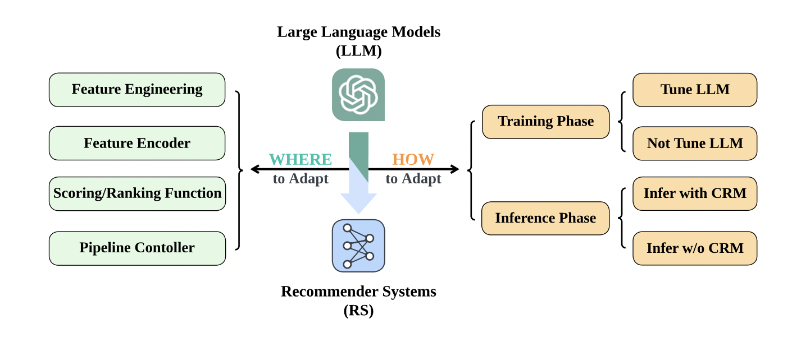

推荐与大语言模型
=====================

何处运用大语言模型
--------------------

特征工程
++++++++++++

- 用户理解：利用 LLM 丰富用户画像
- 内容理解：利用 LLM 进行 Item 画像抽取
- 样本扩充：利用 LLM 进行 Item 生成

特征编码
++++++++++++

利用 LLM 的通用语义信息丰富推荐特征。

打分排序
+++++++++++

- 物品评分任务（Item Scoring Task）：大语言模型对候选物品逐一评分，最后根据分数排序得到最终的排序列表。
- 物品生成任务（Item Generation Task）：通过生成式的方式生成下一个物品的 ID ，或者直接生成排序列表。
- 混合任务（Hybrid Task）：大语言模型天然地适合多任务场景，因此很多工作会利用大语言模型来实现多个推荐任务，其中包括评分任务和生成任务。

流程控制
+++++++++++

使用 LLM 来集成推荐系统流程各模块（检索、排序、用户画像、用户模拟）的一个对话式推荐系统。

如何运用大语言模型
---------------------

四种方案：

- 在训练阶段，大语言模型是否需要微调。
- 在推理阶段，是否需要引入传统推荐模型（CRM），比如直接使用 LLM 生成推荐列表。

两种趋势：

- 模型：引入传统推荐模型（CRM）为语言模型注入协同信号。
- 数据：引入推荐场景的数据，结合微调技术，为语言模型注入协同信号。

参考资料
-------------

1. 一文梳理推荐系统中如何应用大模型

  https://zhuanlan.zhihu.com/p/658252702

2. How Can Recommender Systems Benefit from Large Language Models: A Survey

  https://arxiv.org/pdf/2306.05817.pdf